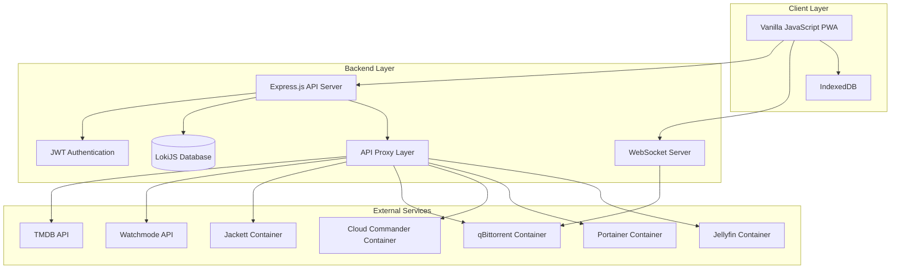
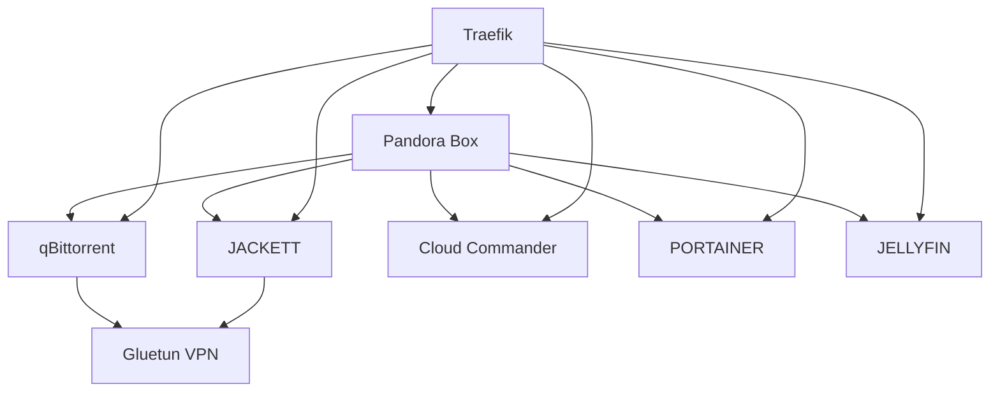

# Design Document

## Overview

Pandora is a comprehensive media management PWA that integrates multiple containerized services through a unified TypeScript backend and vanilla HTML/CSS/JavaScript frontend. The architecture follows a proxy pattern where all external API communications are routed through the backend to ensure security, eliminate CORS issues, and centralize authentication and logging.

**Important Design Principles:**
- **Server-First Approach**: All implementation must first examine and understand the existing server codebase structure before making changes
- **Vanilla Web Standards**: Use native HTML5, CSS3, and ES6+ JavaScript without external UI frameworks
- **Separation of Concerns**: Each functionality must have individual HTML, JS, and CSS files for maintainability
- **No Inline Templates**: Avoid adding template HTML code directly in JavaScript files
- **OTT-Inspired Theming**: Implement multiple themes inspired by Netflix, Prime Video, Hulu, HBO Max, and Disney+ color palettes
- **Mobile-First Responsive**: Design for mobile devices first, then enhance for larger screens

## Architecture

### High-Level Architecture



### Technology Stack

**Frontend:**
- Vanilla HTML5 with semantic markup and accessibility features
- Native CSS3 with CSS Grid, Flexbox, and CSS Variables for theming (`--pb-` namespace)
- Vanilla JavaScript ES6+ modules with native Web APIs
- Vite for build tooling and development server
- PWA capabilities with manifest for installability (no service worker)
- Separate HTML/JS/CSS files per component/page (strict separation)
- CSS-in-CSS approach with multiple OTT-inspired theme files

**Backend (Existing Architecture):**
- Node.js 18+ with TypeScript (already implemented)
- Express.js REST API with comprehensive routing structure
- LokiJS embedded NoSQL database with full CRUD operations
- WebSocket service for real-time updates
- JWT authentication with session management
- Winston logging with structured logging
- API proxy service for external integrations
- Comprehensive middleware stack (auth, rate limiting, CORS, etc.)

**Infrastructure:**
- Docker Compose orchestration
- Traefik reverse proxy (optional)
- Volume persistence for data and logs

## Components and Interfaces

### Frontend Components

#### Core Application Structure (Vanilla Web Standards)
```
client/
├── index.html                      # Main HTML entry point with PWA manifest
├── manifest.json                   # PWA manifest configuration
├── src/
│   ├── js/
│   │   ├── app.js                 # Main application initialization and routing
│   │   ├── router.js              # Native History API-based routing
│   │   ├── store/                 # Application state management (vanilla JS)
│   │   │   ├── auth.js           # Authentication state management
│   │   │   ├── media.js          # Media discovery state management
│   │   │   ├── downloads.js      # Download management state
│   │   │   ├── settings.js       # Application settings state
│   │   │   └── store.js          # Base store implementation
│   │   ├── pages/                # Page controllers (JS only - no HTML)
│   │   │   ├── login/
│   │   │   │   └── login.js      # Login page controller
│   │   │   ├── dashboard/
│   │   │   │   └── dashboard.js  # Media discovery dashboard controller
│   │   │   ├── downloads/
│   │   │   │   └── downloads.js  # Download management controller
│   │   │   ├── files/
│   │   │   │   └── files.js      # File manager controller
│   │   │   ├── containers/
│   │   │   │   └── containers.js # Docker management controller
│   │   │   ├── jellyfin/
│   │   │   │   └── jellyfin.js   # Media server control controller
│   │   │   └── settings/
│   │   │       └── settings.js   # Settings and configuration controller
│   │   ├── components/           # Reusable UI component controllers
│   │   │   ├── media-card/
│   │   │   │   └── media-card.js # Media content card controller
│   │   │   ├── download-item/
│   │   │   │   └── download-item.js # Download progress item controller
│   │   │   ├── file-browser/
│   │   │   │   └── file-browser.js # File system browser controller
│   │   │   ├── container-status/
│   │   │   │   └── container-status.js # Container status controller
│   │   │   ├── navigation/
│   │   │   │   └── navigation.js # Navigation component controller
│   │   │   └── theme-switcher/
│   │   │       └── theme-switcher.js # Theme switching component
│   │   ├── services/             # API communication layer
│   │   │   ├── api.js           # Base API client using fetch
│   │   │   ├── auth.js          # Authentication service
│   │   │   ├── media.js         # Media discovery API
│   │   │   ├── torrents.js      # Torrent management API
│   │   │   ├── files.js         # File operations API
│   │   │   ├── containers.js    # Container management API
│   │   │   └── jellyfin.js      # Jellyfin API
│   │   └── utils/               # Utility functions
│   │       ├── storage.js       # IndexedDB operations
│   │       ├── websocket.js     # WebSocket client
│   │       ├── theme-manager.js # Advanced theme management
│   │       ├── dom-utils.js     # DOM manipulation utilities
│   │       └── validators.js    # Form validation utilities
│   ├── pages/                   # Page templates (HTML only - no JavaScript)
│   │   ├── login/
│   │   │   └── login.html       # Login page template
│   │   ├── dashboard/
│   │   │   └── dashboard.html   # Media discovery dashboard template
│   │   ├── downloads/
│   │   │   └── downloads.html   # Download management template
│   │   ├── files/
│   │   │   └── files.html       # File manager template
│   │   ├── containers/
│   │   │   └── containers.html  # Docker management template
│   │   ├── jellyfin/
│   │   │   └── jellyfin.html    # Media server control template
│   │   └── settings/
│   │       └── settings.html    # Settings and configuration template
│   ├── components/              # Reusable UI component templates (HTML only)
│   │   ├── media-card/
│   │   │   └── media-card.html  # Media content card template
│   │   ├── download-item/
│   │   │   └── download-item.html # Download progress item template
│   │   ├── file-browser/
│   │   │   └── file-browser.html # File system browser template
│   │   ├── container-status/
│   │   │   └── container-status.html # Container status template
│   │   ├── navigation/
│   │   │   └── navigation.html  # Navigation component template
│   │   └── theme-switcher/
│   │       └── theme-switcher.html # Theme switcher template
│   └── css/
│       ├── base/                # Base styles and resets
│       │   ├── reset.css        # CSS reset/normalize
│       │   ├── typography.css   # Typography system
│       │   ├── layout.css       # Layout utilities (grid, flexbox)
│       │   └── animations.css   # Animation definitions
│       ├── components/          # Component-specific styles (CSS only)
│       │   ├── media-card/
│       │   │   └── media-card.css # Media card component styles
│       │   ├── download-item/
│       │   │   └── download-item.css # Download item component styles
│       │   ├── file-browser/
│       │   │   └── file-browser.css # File browser component styles
│       │   ├── container-status/
│       │   │   └── container-status.css # Container status styles
│       │   ├── navigation/
│       │   │   └── navigation.css # Navigation component styles
│       │   └── theme-switcher/
│       │       └── theme-switcher.css # Theme switcher styles
│       ├── pages/               # Page-specific styles (CSS only)
│       │   ├── login/
│       │   │   └── login.css    # Login page styles
│       │   ├── dashboard/
│       │   │   └── dashboard.css # Dashboard page styles
│       │   ├── downloads/
│       │   │   └── downloads.css # Downloads page styles
│       │   ├── files/
│       │   │   └── files.css    # Files page styles
│       │   ├── containers/
│       │   │   └── containers.css # Containers page styles
│       │   ├── jellyfin/
│       │   │   └── jellyfin.css # Jellyfin page styles
│       │   └── settings/
│       │       └── settings.css # Settings page styles
│       └── themes/              # OTT-inspired theme variations
│           ├── netflix.css      # Netflix-inspired dark theme (default)
│           ├── prime-video.css  # Prime Video-inspired theme
│           ├── hulu.css         # Hulu-inspired theme
│           ├── hbo-max.css      # HBO Max-inspired theme
│           ├── disney-plus.css  # Disney+ inspired theme
│           ├── apple-tv.css     # Apple TV+ inspired theme
│           └── custom.css       # User customizable theme
├── vite.config.js              # Vite configuration
└── package.json                # Frontend dependencies (minimal)
```

#### Vanilla Web Standards Implementation Patterns

**IMPORTANT**: All frontend development must follow vanilla web standards and modern JavaScript patterns

**File Organization Pattern:**
- Each page/component must have separate HTML, JS, and CSS files (strict separation)
- No inline HTML templates in JavaScript files
- Use native History API for routing and navigation
- Follow modern ES6+ module patterns and Web Component lifecycle

**Page Structure Example:**
```
pages/dashboard/
├── dashboard.html    # Template only (no JavaScript, no CSS)
├── dashboard.js      # Logic only (no HTML strings, no CSS)
└── dashboard.css     # Styles only (no JavaScript, no HTML)
```

**Vanilla HTML Page Template Pattern (dashboard.html):**
```html
<main class="page dashboard-page" data-page="dashboard">
  <header class="page-header">
    <h1 class="page-title">Media Dashboard</h1>
    <nav class="page-nav">
      <!-- Navigation elements -->
    </nav>
  </header>
  
  <section class="page-content">
    <div class="content-grid">
      <!-- Page content structure -->
    </div>
  </section>
  
  <footer class="page-footer">
    <!-- Footer content -->
  </footer>
</main>
```

**Vanilla JavaScript Page Controller Pattern (dashboard.js):**
```javascript
class DashboardPage {
  constructor() {
    this.container = null;
    this.isInitialized = false;
  }

  async init() {
    if (this.isInitialized) return;
    
    // Load HTML template
    const template = await this.loadTemplate();
    this.container = document.createElement('div');
    this.container.innerHTML = template;
    
    // Initialize page logic
    this.setupEventListeners();
    this.loadInitialData();
    
    this.isInitialized = true;
  }

  async loadTemplate() {
    const response = await fetch('/src/pages/dashboard/dashboard.html');
    return await response.text();
  }

  setupEventListeners() {
    // Event listener setup
  }

  async loadInitialData() {
    // Data loading logic
  }

  render(targetElement) {
    if (targetElement && this.container) {
      targetElement.innerHTML = '';
      targetElement.appendChild(this.container);
    }
  }

  destroy() {
    // Cleanup logic
    this.isInitialized = false;
  }
}

export default DashboardPage;
```

**CSS-Only Styling Pattern (dashboard.css):**
```css
/* Dashboard page specific styles */
.dashboard-page {
  /* Page layout using CSS Grid */
  display: grid;
  grid-template-rows: auto 1fr auto;
  min-height: 100vh;
}

.dashboard-page .page-header {
  /* Header styles */
}

.dashboard-page .page-content {
  /* Content area styles */
}

.dashboard-page .content-grid {
  /* Content grid layout */
  display: grid;
  grid-template-columns: repeat(auto-fit, minmax(300px, 1fr));
  gap: var(--pb-spacing-lg);
}

/* Responsive design */
@media (max-width: 768px) {
  .dashboard-page .content-grid {
    grid-template-columns: 1fr;
  }
}
```

#### OTT-Inspired Theme System

**Theme Manager Architecture:**
The application implements a comprehensive theme system inspired by major OTT platforms, using CSS custom properties for dynamic theming.

**Theme Structure:**
```javascript
class ThemeManager {
  constructor() {
    this.currentTheme = 'netflix'; // Default theme
    this.availableThemes = [
      'netflix', 'prime-video', 'hulu', 'hbo-max', 
      'disney-plus', 'apple-tv', 'custom'
    ];
  }

  async loadTheme(themeName) {
    // Dynamically load theme CSS
    const themeCSS = await fetch(`/src/css/themes/${themeName}.css`);
    const cssText = await themeCSS.text();
    this.applyTheme(cssText);
  }

  applyTheme(cssText) {
    // Apply theme using CSS custom properties
    const styleSheet = new CSSStyleSheet();
    styleSheet.replaceSync(cssText);
    document.adoptedStyleSheets = [styleSheet];
  }

  setTheme(themeName) {
    if (this.availableThemes.includes(themeName)) {
      this.currentTheme = themeName;
      this.loadTheme(themeName);
      localStorage.setItem('pb-theme', themeName);
    }
  }
}
```

**Netflix Theme (Default) - netflix.css:**
```css
:root {
  /* Netflix-inspired color palette */
  --pb-primary: #e50914;           /* Netflix red */
  --pb-primary-dark: #b20710;     /* Darker red */
  --pb-primary-light: #ff1e2d;    /* Lighter red */
  
  --pb-background: #141414;        /* Netflix dark background */
  --pb-background-secondary: #1f1f1f; /* Card backgrounds */
  --pb-background-tertiary: #2a2a2a;  /* Elevated surfaces */
  
  --pb-text-primary: #ffffff;      /* Primary text */
  --pb-text-secondary: #b3b3b3;    /* Secondary text */
  --pb-text-muted: #808080;        /* Muted text */
  
  --pb-accent: #46d369;            /* Success/download green */
  --pb-warning: #f5c518;           /* Warning yellow */
  --pb-error: #ff4757;             /* Error red */
  
  --pb-border: #333333;            /* Border color */
  --pb-shadow: rgba(0, 0, 0, 0.75); /* Shadow color */
}
```

**Prime Video Theme - prime-video.css:**
```css
:root {
  /* Prime Video-inspired color palette */
  --pb-primary: #00a8e1;           /* Prime blue */
  --pb-primary-dark: #0073a8;     /* Darker blue */
  --pb-primary-light: #33b9e8;    /* Lighter blue */
  
  --pb-background: #0f171e;        /* Prime dark blue background */
  --pb-background-secondary: #1a252f; /* Card backgrounds */
  --pb-background-tertiary: #232f3e;  /* Elevated surfaces */
  
  --pb-text-primary: #ffffff;      /* Primary text */
  --pb-text-secondary: #aeb7c2;    /* Secondary text */
  --pb-text-muted: #7d8590;        /* Muted text */
  
  --pb-accent: #ff9500;            /* Prime orange accent */
  --pb-warning: #ffb84d;           /* Warning orange */
  --pb-error: #ff4757;             /* Error red */
  
  --pb-border: #37475a;            /* Border color */
  --pb-shadow: rgba(0, 0, 0, 0.8); /* Shadow color */
}
```

**Hulu Theme - hulu.css:**
```css
:root {
  /* Hulu-inspired color palette */
  --pb-primary: #1ce783;           /* Hulu green */
  --pb-primary-dark: #17c46f;     /* Darker green */
  --pb-primary-light: #3ced97;    /* Lighter green */
  
  --pb-background: #0b0e0f;        /* Hulu dark background */
  --pb-background-secondary: #151a1e; /* Card backgrounds */
  --pb-background-tertiary: #1f262b;  /* Elevated surfaces */
  
  --pb-text-primary: #ffffff;      /* Primary text */
  --pb-text-secondary: #b8c5d1;    /* Secondary text */
  --pb-text-muted: #8a9ba8;        /* Muted text */
  
  --pb-accent: #ff6b35;            /* Hulu orange accent */
  --pb-warning: #ffa726;           /* Warning orange */
  --pb-error: #f44336;             /* Error red */
  
  --pb-border: #2d3e50;            /* Border color */
  --pb-shadow: rgba(0, 0, 0, 0.85); /* Shadow color */
}
```

**HBO Max Theme - hbo-max.css:**
```css
:root {
  /* HBO Max-inspired color palette */
  --pb-primary: #9146ff;           /* HBO purple */
  --pb-primary-dark: #7c3aed;     /* Darker purple */
  --pb-primary-light: #a855f7;    /* Lighter purple */
  
  --pb-background: #100e17;        /* HBO dark purple background */
  --pb-background-secondary: #1a1625; /* Card backgrounds */
  --pb-background-tertiary: #241f33;  /* Elevated surfaces */
  
  --pb-text-primary: #ffffff;      /* Primary text */
  --pb-text-secondary: #c4b5fd;    /* Secondary text */
  --pb-text-muted: #a78bfa;        /* Muted text */
  
  --pb-accent: #f59e0b;            /* HBO gold accent */
  --pb-warning: #fbbf24;           /* Warning yellow */
  --pb-error: #ef4444;             /* Error red */
  
  --pb-border: #4c1d95;            /* Border color */
  --pb-shadow: rgba(16, 14, 23, 0.9); /* Shadow color */
}
```

**Disney+ Theme - disney-plus.css:**
```css
:root {
  /* Disney+ inspired color palette */
  --pb-primary: #113ccf;           /* Disney blue */
  --pb-primary-dark: #0d2db3;     /* Darker blue */
  --pb-primary-light: #2563eb;    /* Lighter blue */
  
  --pb-background: #040814;        /* Disney dark background */
  --pb-background-secondary: #0f1419; /* Card backgrounds */
  --pb-background-tertiary: #1a202c;  /* Elevated surfaces */
  
  --pb-text-primary: #f7fafc;      /* Primary text */
  --pb-text-secondary: #cbd5e0;    /* Secondary text */
  --pb-text-muted: #a0aec0;        /* Muted text */
  
  --pb-accent: #f6ad55;            /* Disney gold accent */
  --pb-warning: #ed8936;           /* Warning orange */
  --pb-error: #e53e3e;             /* Error red */
  
  --pb-border: #2d3748;            /* Border color */
  --pb-shadow: rgba(4, 8, 20, 0.9); /* Shadow color */
}
```

**Apple TV+ Theme - apple-tv.css:**
```css
:root {
  /* Apple TV+ inspired color palette */
  --pb-primary: #000000;           /* Apple black */
  --pb-primary-dark: #1a1a1a;     /* Dark gray */
  --pb-primary-light: #333333;    /* Light gray */
  
  --pb-background: #000000;        /* Pure black background */
  --pb-background-secondary: #1c1c1e; /* Card backgrounds */
  --pb-background-tertiary: #2c2c2e;  /* Elevated surfaces */
  
  --pb-text-primary: #ffffff;      /* Primary text */
  --pb-text-secondary: #ebebf5;    /* Secondary text */
  --pb-text-muted: #8e8e93;        /* Muted text */
  
  --pb-accent: #007aff;            /* Apple blue accent */
  --pb-warning: #ff9500;           /* Warning orange */
  --pb-error: #ff3b30;             /* Error red */
  
  --pb-border: #38383a;            /* Border color */
  --pb-shadow: rgba(0, 0, 0, 0.95); /* Shadow color */
}
```

#### Key Frontend Interfaces

**API Client Interface:**
```javascript
class ApiClient {
  constructor(baseURL, authToken) {
    this.baseURL = baseURL;
    this.authToken = authToken;
  }

  async get(endpoint, params = {}) {
    const url = new URL(endpoint, this.baseURL);
    Object.keys(params).forEach(key => url.searchParams.append(key, params[key]));
    
    return await this.request(url, { method: 'GET' });
  }

  async post(endpoint, data = {}) {
    return await this.request(new URL(endpoint, this.baseURL), {
      method: 'POST',
      headers: { 'Content-Type': 'application/json' },
      body: JSON.stringify(data)
    });
  }

  async put(endpoint, data = {}) {
    return await this.request(new URL(endpoint, this.baseURL), {
      method: 'PUT',
      headers: { 'Content-Type': 'application/json' },
      body: JSON.stringify(data)
    });
  }

  async delete(endpoint) {
    return await this.request(new URL(endpoint, this.baseURL), { method: 'DELETE' });
  }

  setAuthToken(token) {
    this.authToken = token;
  }

  async request(url, options = {}) {
    const headers = {
      ...options.headers,
      ...(this.authToken && { 'Authorization': `Bearer ${this.authToken}` })
    };

    const response = await fetch(url, { ...options, headers });
    
    if (!response.ok) {
      throw new Error(`HTTP ${response.status}: ${response.statusText}`);
    }

    return await response.json();
  }

  handleError(error) {
    console.error('API Error:', error);
    throw error;
  }
}
```

**WebSocket Client Interface:**
```javascript
class WebSocketClient {
  constructor(url, authToken) {
    this.url = url;
    this.authToken = authToken;
    this.ws = null;
    this.subscriptions = new Map();
    this.reconnectAttempts = 0;
    this.maxReconnectAttempts = 5;
  }

  connect() {
    return new Promise((resolve, reject) => {
      try {
        this.ws = new WebSocket(`${this.url}?token=${this.authToken}`);
        
        this.ws.onopen = () => {
          this.reconnectAttempts = 0;
          resolve();
        };

        this.ws.onmessage = (event) => {
          const message = JSON.parse(event.data);
          this.handleMessage(message);
        };

        this.ws.onclose = () => {
          this.handleReconnect();
        };

        this.ws.onerror = (error) => {
          reject(error);
        };
      } catch (error) {
        reject(error);
      }
    });
  }

  disconnect() {
    if (this.ws) {
      this.ws.close();
      this.ws = null;
    }
  }

  subscribe(channel, callback) {
    if (!this.subscriptions.has(channel)) {
      this.subscriptions.set(channel, new Set());
    }
    this.subscriptions.get(channel).add(callback);
  }

  unsubscribe(channel, callback = null) {
    if (callback) {
      this.subscriptions.get(channel)?.delete(callback);
    } else {
      this.subscriptions.delete(channel);
    }
  }

  send(message) {
    if (this.ws && this.ws.readyState === WebSocket.OPEN) {
      this.ws.send(JSON.stringify(message));
    }
  }

  handleMessage(message) {
    const callbacks = this.subscriptions.get(message.channel);
    if (callbacks) {
      callbacks.forEach(callback => callback(message.data));
    }
  }

  handleReconnect() {
    if (this.reconnectAttempts < this.maxReconnectAttempts) {
      this.reconnectAttempts++;
      setTimeout(() => this.connect(), 1000 * this.reconnectAttempts);
    }
  }
}
```

**Router Interface (Native History API):**
```javascript
class Router {
  constructor() {
    this.routes = new Map();
    this.currentPage = null;
    this.init();
  }

  init() {
    window.addEventListener('popstate', () => this.handleRoute());
    this.handleRoute();
  }

  addRoute(path, pageClass) {
    this.routes.set(path, pageClass);
  }

  navigate(path, pushState = true) {
    if (pushState) {
      history.pushState(null, '', path);
    }
    this.handleRoute();
  }

  async handleRoute() {
    const path = window.location.pathname;
    const PageClass = this.routes.get(path);

    if (PageClass) {
      // Cleanup current page
      if (this.currentPage && this.currentPage.destroy) {
        this.currentPage.destroy();
      }

      // Initialize new page
      this.currentPage = new PageClass();
      await this.currentPage.init();
      
      // Render page
      const appContainer = document.getElementById('app');
      this.currentPage.render(appContainer);
    }
  }
}
```

### Backend Components (Existing Implementation)

**IMPORTANT**: Before implementing any backend changes, developers MUST:
1. Read and understand the existing server codebase in `server/src/`
2. Examine current API endpoints and their implementations
3. Review the database schema and service layer architecture
4. Understand the existing middleware and authentication flow

#### Current Server Structure (✓ Fully Implemented)
```
server/src/
├── app.ts                # Express application setup (✓ Implemented)
├── config/
│   └── config.ts        # Comprehensive configuration management (✓ Implemented)
├── middleware/          # Express middleware
│   ├── auth.ts          # JWT authentication (✓ Implemented)
│   └── errorHandler.ts  # Error handling (✓ Implemented)
├── routes/              # API route handlers (✓ All Implemented)
│   ├── auth.ts          # Authentication endpoints
│   ├── media.ts         # Media discovery endpoints
│   ├── streaming.ts     # Streaming service endpoints
│   ├── downloads.ts     # Download management endpoints
│   ├── files.ts         # File operations endpoints
│   ├── docker.ts        # Container management endpoints
│   ├── jellyfin.ts      # Jellyfin control endpoints
│   ├── settings.ts      # Settings management endpoints
│   └── health.ts        # Health check endpoints
├── controllers/         # Business logic controllers (✓ All Implemented)
│   ├── auth.ts          # Authentication controller
│   ├── media.ts         # Media discovery controller
│   ├── qbittorrent.ts   # qBittorrent controller
│   ├── cloudcommander.ts # Cloud Commander controller
│   ├── portainer.ts     # Portainer controller
│   ├── jellyfin.ts      # Jellyfin controller
│   ├── streaming.ts     # Streaming services controller
│   └── torrent.ts       # Torrent management controller
├── services/            # Core services (✓ All Implemented)
│   ├── database.ts      # LokiJS database service with full CRUD
│   ├── apiProxy.ts      # API proxy service for external APIs
│   ├── websocket.ts     # WebSocket service for real-time updates
│   └── httpClient.ts    # HTTP client utilities
├── types/               # TypeScript type definitions (✓ Implemented)
│   └── database.ts      # Database schema types
└── utils/               # Utility functions (✓ Implemented)
    └── logger.ts        # Winston logger with structured logging
```

#### Existing API Endpoints (Must be used by frontend)

**Base URL**: `/api/v1`

**Authentication Endpoints** (`/auth`):
- `POST /login` - User authentication
- `POST /refresh` - Token refresh
- `POST /logout` - User logout
- `GET /verify` - Token verification
- `GET /profile` - Get user profile
- `PUT /profile` - Update user profile
- `PUT /password` - Change password
- `POST /register` - Register new user (admin only)
- `GET /users` - List all users (admin only)
- `DELETE /users/:userId` - Delete user (admin only)

**Media Discovery Endpoints** (`/media`):
- `GET /trending/:type/:timeWindow` - Get trending content
- `GET /popular/:type` - Get popular content
- `GET /top-rated/:type` - Get top rated content
- `GET /search` - Search media content
- `GET /:type/:id` - Get content details
- `GET /genres/:type` - Get genres list
- `DELETE /cache` - Clear media cache
- `GET /cache/stats` - Get cache statistics

**Download Management Endpoints** (`/downloads`):
- `GET /` - List all torrents
- `GET /transfer-info` - Get transfer information
- `GET /preferences` - Get qBittorrent preferences
- `GET /:hash/details` - Get torrent details
- `GET /search-torrents` - Search torrents via Jackett
- `GET /indexers` - Get available indexers
- `GET /categories` - Get torrent categories
- `GET /search-history` - Get search history
- `DELETE /search-history` - Clear search history
- `POST /add` - Add new torrent
- `POST /:hash/control` - Control torrent (pause/resume/delete)

**Additional Endpoints Available**:
- `/files` - File management operations
- `/docker` - Container management
- `/jellyfin` - Jellyfin media server control
- `/streaming` - Streaming service integration
- `/settings` - Application settings management
- `/health` - Health check endpoints

#### Key Backend Interfaces

**Service Interface Pattern:**
```typescript
interface BaseService {
  initialize(): Promise<void>
  healthCheck(): Promise<boolean>
  getStatus(): ServiceStatus
}

interface MediaService extends BaseService {
  searchMovies(query: string): Promise<Movie[]>
  searchTVShows(query: string): Promise<TVShow[]>
  getTrending(type: 'movie' | 'tv'): Promise<MediaItem[]>
  getDetails(id: string, type: 'movie' | 'tv'): Promise<MediaDetails>
}
```

**Proxy Interface Pattern:**
```typescript
interface ApiProxy {
  baseURL: string
  apiKey?: string
  timeout: number
  
  get<T>(endpoint: string, params?: any): Promise<T>
  post<T>(endpoint: string, data?: any): Promise<T>
  handleError(error: any): never
}
```

## Data Models

### LokiJS Database Schema

#### Collections Structure
```typescript
// Users Collection
interface User {
  $loki?: number
  id: string
  username: string
  passwordHash: string
  role: 'admin' | 'team'
  createdAt: Date
  lastLogin?: Date
  settings: UserSettings
}

// Sessions Collection
interface Session {
  $loki?: number
  id: string
  userId: string
  token: string
  expiresAt: Date
  createdAt: Date
  lastAccessed: Date
  userAgent?: string
  ipAddress?: string
}

// Downloads Collection
interface Download {
  $loki?: number
  id: string
  userId: string
  magnetUri: string
  name: string
  size: number
  status: 'queued' | 'downloading' | 'completed' | 'failed' | 'paused'
  progress: number
  downloadSpeed: number
  uploadSpeed: number
  eta: number
  addedAt: Date
  completedAt?: Date
  trackers: string[]
  category?: string
  savePath: string
}

// FileOperations Collection
interface FileOperation {
  $loki?: number
  id: string
  userId: string
  operation: 'move' | 'copy' | 'delete' | 'rename'
  sourcePath: string
  destinationPath?: string
  status: 'pending' | 'completed' | 'failed'
  error?: string
  timestamp: Date
}

// Settings Collection
interface AppSettings {
  $loki?: number
  id: string
  category: string
  key: string
  value: any
  encrypted: boolean
  updatedAt: Date
  updatedBy: string
}

// MediaCache Collection (for TMDB/Watchmode data)
interface MediaCache {
  $loki?: number
  id: string
  type: 'movie' | 'tv'
  externalId: string
  source: 'tmdb' | 'watchmode'
  data: any
  cachedAt: Date
  expiresAt: Date
}
```

### API Response Models

#### Media Discovery Models
```typescript
interface MediaItem {
  id: string
  title: string
  overview: string
  posterPath?: string
  backdropPath?: string
  releaseDate: string
  voteAverage: number
  voteCount: number
  genres: Genre[]
  cast?: CastMember[]
  streamingAvailability?: StreamingProvider[]
}

interface TorrentResult {
  title: string
  magnetUri: string
  size: number
  seeders: number
  leechers: number
  tracker: string
  category: string
  publishDate: Date
  quality?: string
}
```

## Error Handling

### Frontend Error Handling Strategy

**Global Error Handler:**
```javascript
class ErrorHandler {
  static handle(error, context) {
    // Log error
    console.error(`Error in ${context}:`, error)
    
    // Show user-friendly message
    if (error.status === 401) {
      this.handleAuthError()
    } else if (error.status >= 500) {
      this.showServerError()
    } else {
      this.showGenericError(error.message)
    }
  }
  
  static handleAuthError() {
    // Clear stored tokens and redirect to login
    AuthService.logout()
    app.views.main.router.navigate('/login/')
  }
}
```

### Backend Error Handling Strategy

**Centralized Error Middleware:**
```typescript
interface ApiError extends Error {
  status: number
  code: string
  details?: any
}

const errorHandler = (error: ApiError, req: Request, res: Response, next: NextFunction) => {
  logger.error('API Error:', {
    error: error.message,
    stack: error.stack,
    url: req.url,
    method: req.method,
    userId: req.user?.id
  })
  
  const response = {
    error: true,
    message: error.message,
    code: error.code,
    ...(process.env.NODE_ENV === 'development' && { stack: error.stack })
  }
  
  res.status(error.status || 500).json(response)
}
```

## Development Workflow

### Pre-Implementation Requirements

**CRITICAL**: Before implementing any feature, developers MUST:

1. **Examine Existing Server Code**:
   - Read relevant controller files in `server/src/controllers/`
   - Understand existing API endpoints in `server/src/routes/`
   - Review database models in `server/src/types/database.ts`
   - Check existing services in `server/src/services/`

2. **Follow Vanilla Web Standards**:
   - Use semantic HTML5 elements for accessibility and SEO
   - Implement responsive design with CSS Grid and Flexbox
   - Use modern JavaScript ES6+ features and native Web APIs
   - Follow progressive enhancement principles
   - Implement proper ARIA attributes for accessibility

3. **File Organization Standards**:
   - Create separate HTML, JS, and CSS files for each component/page (strict separation)
   - Never embed HTML templates in JavaScript strings
   - Use native fetch API for template loading
   - Follow the established directory structure with proper separation
   - Use CSS custom properties for theming consistency

4. **Theme System Requirements**:
   - All components must support the OTT-inspired theme system
   - Use CSS custom properties with `--pb-` namespace exclusively
   - Test components across all available themes
   - Ensure proper contrast ratios for accessibility

### Implementation Process

1. **API Integration**: Use existing endpoints documented above with native fetch API
2. **Component Creation**: Follow vanilla JavaScript class-based component patterns
3. **State Management**: Implement using custom vanilla JavaScript state management
4. **Styling**: Use CSS custom properties and the comprehensive theme system
5. **Routing**: Use native History API for client-side routing
6. **Testing**: Test against existing backend services and across all themes

### Code Quality Standards

- **Separation of Concerns**: Logic, templates, and styles in completely separate files
- **Web Standards Compliance**: All components must use vanilla web technologies
- **API Consistency**: Use existing backend endpoints without modification
- **Accessibility**: Meet WCAG 2.1 AA standards for all components
- **Performance**: Optimize for mobile-first, progressive enhancement
- **Documentation**: Comment complex logic and API integrations
- **Theme Compatibility**: Ensure all components work across all OTT-inspired themes

## Theme System Architecture

### Theme Management Implementation

**Theme Manager Class (theme-manager.js):**
```javascript
class ThemeManager {
  constructor() {
    this.currentTheme = this.getStoredTheme() || 'netflix';
    this.themeChangeCallbacks = new Set();
    this.init();
  }

  init() {
    // Apply stored theme on initialization
    this.applyTheme(this.currentTheme);
    
    // Listen for system theme changes
    if (window.matchMedia) {
      window.matchMedia('(prefers-color-scheme: dark)').addEventListener('change', (e) => {
        if (this.currentTheme === 'auto') {
          this.applySystemTheme();
        }
      });
    }
  }

  async applyTheme(themeName) {
    try {
      // Remove existing theme
      this.removeCurrentTheme();
      
      // Load and apply new theme
      const themeCSS = await this.loadThemeCSS(themeName);
      this.injectThemeCSS(themeCSS, themeName);
      
      // Update current theme
      this.currentTheme = themeName;
      this.storeTheme(themeName);
      
      // Notify listeners
      this.notifyThemeChange(themeName);
      
      // Update meta theme-color for PWA
      this.updateMetaThemeColor();
      
    } catch (error) {
      console.error('Failed to apply theme:', error);
      // Fallback to default theme
      if (themeName !== 'netflix') {
        this.applyTheme('netflix');
      }
    }
  }

  async loadThemeCSS(themeName) {
    const response = await fetch(`/src/css/themes/${themeName}.css`);
    if (!response.ok) {
      throw new Error(`Failed to load theme: ${themeName}`);
    }
    return await response.text();
  }

  injectThemeCSS(cssText, themeName) {
    const styleElement = document.createElement('style');
    styleElement.id = `theme-${themeName}`;
    styleElement.textContent = cssText;
    document.head.appendChild(styleElement);
  }

  removeCurrentTheme() {
    const existingTheme = document.querySelector('[id^="theme-"]');
    if (existingTheme) {
      existingTheme.remove();
    }
  }

  updateMetaThemeColor() {
    const themeColorMeta = document.querySelector('meta[name="theme-color"]');
    const backgroundColor = getComputedStyle(document.documentElement)
      .getPropertyValue('--pb-background').trim();
    
    if (themeColorMeta) {
      themeColorMeta.setAttribute('content', backgroundColor);
    }
  }

  getAvailableThemes() {
    return [
      { id: 'netflix', name: 'Netflix', description: 'Classic red and black theme' },
      { id: 'prime-video', name: 'Prime Video', description: 'Blue and dark theme' },
      { id: 'hulu', name: 'Hulu', description: 'Green and dark theme' },
      { id: 'hbo-max', name: 'HBO Max', description: 'Purple and dark theme' },
      { id: 'disney-plus', name: 'Disney+', description: 'Blue and magical theme' },
      { id: 'apple-tv', name: 'Apple TV+', description: 'Minimalist black theme' },
      { id: 'custom', name: 'Custom', description: 'User customizable theme' }
    ];
  }

  onThemeChange(callback) {
    this.themeChangeCallbacks.add(callback);
  }

  offThemeChange(callback) {
    this.themeChangeCallbacks.delete(callback);
  }

  notifyThemeChange(themeName) {
    this.themeChangeCallbacks.forEach(callback => {
      try {
        callback(themeName);
      } catch (error) {
        console.error('Theme change callback error:', error);
      }
    });
  }

  storeTheme(themeName) {
    localStorage.setItem('pb-theme', themeName);
  }

  getStoredTheme() {
    return localStorage.getItem('pb-theme');
  }
}
```

### CSS Custom Properties System

**Base CSS Variables Structure:**
```css
/* Base variables that all themes must define */
:root {
  /* Primary Colors */
  --pb-primary: #e50914;
  --pb-primary-dark: #b20710;
  --pb-primary-light: #ff1e2d;
  --pb-primary-rgb: 229, 9, 20; /* For rgba() usage */

  /* Background Colors */
  --pb-background: #141414;
  --pb-background-secondary: #1f1f1f;
  --pb-background-tertiary: #2a2a2a;
  --pb-background-overlay: rgba(0, 0, 0, 0.8);

  /* Text Colors */
  --pb-text-primary: #ffffff;
  --pb-text-secondary: #b3b3b3;
  --pb-text-muted: #808080;
  --pb-text-inverse: #000000;

  /* Status Colors */
  --pb-success: #46d369;
  --pb-warning: #f5c518;
  --pb-error: #ff4757;
  --pb-info: #3498db;

  /* Interactive Colors */
  --pb-border: #333333;
  --pb-border-light: #555555;
  --pb-shadow: rgba(0, 0, 0, 0.75);
  --pb-focus: var(--pb-primary);
  --pb-hover: rgba(255, 255, 255, 0.1);

  /* Spacing System */
  --pb-spacing-xs: 0.25rem;   /* 4px */
  --pb-spacing-sm: 0.5rem;    /* 8px */
  --pb-spacing-md: 1rem;      /* 16px */
  --pb-spacing-lg: 1.5rem;    /* 24px */
  --pb-spacing-xl: 2rem;      /* 32px */
  --pb-spacing-2xl: 3rem;     /* 48px */

  /* Typography */
  --pb-font-family-primary: 'Inter', -apple-system, BlinkMacSystemFont, sans-serif;
  --pb-font-family-mono: 'JetBrains Mono', 'Fira Code', monospace;
  
  --pb-font-size-xs: 0.75rem;   /* 12px */
  --pb-font-size-sm: 0.875rem;  /* 14px */
  --pb-font-size-md: 1rem;      /* 16px */
  --pb-font-size-lg: 1.125rem;  /* 18px */
  --pb-font-size-xl: 1.25rem;   /* 20px */
  --pb-font-size-2xl: 1.5rem;   /* 24px */
  --pb-font-size-3xl: 2rem;     /* 32px */

  --pb-font-weight-normal: 400;
  --pb-font-weight-medium: 500;
  --pb-font-weight-semibold: 600;
  --pb-font-weight-bold: 700;

  /* Border Radius */
  --pb-radius-sm: 0.25rem;    /* 4px */
  --pb-radius-md: 0.5rem;     /* 8px */
  --pb-radius-lg: 0.75rem;    /* 12px */
  --pb-radius-xl: 1rem;       /* 16px */
  --pb-radius-full: 9999px;   /* Full radius */

  /* Transitions */
  --pb-transition-fast: 150ms ease-in-out;
  --pb-transition-normal: 250ms ease-in-out;
  --pb-transition-slow: 350ms ease-in-out;

  /* Z-Index Scale */
  --pb-z-dropdown: 1000;
  --pb-z-modal: 1050;
  --pb-z-popover: 1060;
  --pb-z-tooltip: 1070;
  --pb-z-toast: 1080;
}
```

### Theme Switcher Component

**Theme Switcher HTML (theme-switcher.html):**
```html
<div class="theme-switcher" data-component="theme-switcher">
  <button class="theme-switcher__trigger" aria-label="Change theme">
    <svg class="theme-switcher__icon" viewBox="0 0 24 24">
      <path d="M12 2C6.48 2 2 6.48 2 12s4.48 10 10 10 10-4.48 10-10S17.52 2 12 2zm-2 15l-5-5 1.41-1.41L10 14.17l7.59-7.59L19 8l-9 9z"/>
    </svg>
  </button>
  
  <div class="theme-switcher__dropdown" hidden>
    <div class="theme-switcher__header">
      <h3>Choose Theme</h3>
    </div>
    
    <div class="theme-switcher__grid">
      <!-- Theme options will be populated by JavaScript -->
    </div>
  </div>
</div>
```

**Theme Switcher CSS (theme-switcher.css):**
```css
.theme-switcher {
  position: relative;
  display: inline-block;
}

.theme-switcher__trigger {
  display: flex;
  align-items: center;
  justify-content: center;
  width: 2.5rem;
  height: 2.5rem;
  background: var(--pb-background-secondary);
  border: 1px solid var(--pb-border);
  border-radius: var(--pb-radius-md);
  color: var(--pb-text-secondary);
  cursor: pointer;
  transition: all var(--pb-transition-fast);
}

.theme-switcher__trigger:hover {
  background: var(--pb-hover);
  color: var(--pb-text-primary);
}

.theme-switcher__icon {
  width: 1.25rem;
  height: 1.25rem;
  fill: currentColor;
}

.theme-switcher__dropdown {
  position: absolute;
  top: calc(100% + var(--pb-spacing-sm));
  right: 0;
  min-width: 20rem;
  background: var(--pb-background-secondary);
  border: 1px solid var(--pb-border);
  border-radius: var(--pb-radius-lg);
  box-shadow: 0 10px 25px var(--pb-shadow);
  z-index: var(--pb-z-dropdown);
  animation: fadeInUp var(--pb-transition-fast);
}

.theme-switcher__header {
  padding: var(--pb-spacing-md);
  border-bottom: 1px solid var(--pb-border);
}

.theme-switcher__header h3 {
  margin: 0;
  font-size: var(--pb-font-size-lg);
  font-weight: var(--pb-font-weight-semibold);
  color: var(--pb-text-primary);
}

.theme-switcher__grid {
  display: grid;
  grid-template-columns: 1fr;
  gap: var(--pb-spacing-xs);
  padding: var(--pb-spacing-md);
}

.theme-option {
  display: flex;
  align-items: center;
  gap: var(--pb-spacing-md);
  padding: var(--pb-spacing-md);
  background: transparent;
  border: 1px solid transparent;
  border-radius: var(--pb-radius-md);
  cursor: pointer;
  transition: all var(--pb-transition-fast);
}

.theme-option:hover {
  background: var(--pb-hover);
  border-color: var(--pb-border-light);
}

.theme-option.active {
  background: rgba(var(--pb-primary-rgb), 0.1);
  border-color: var(--pb-primary);
}

.theme-option__preview {
  width: 2rem;
  height: 2rem;
  border-radius: var(--pb-radius-sm);
  display: flex;
  overflow: hidden;
}

.theme-option__preview-color {
  flex: 1;
  height: 100%;
}

.theme-option__info h4 {
  margin: 0 0 var(--pb-spacing-xs) 0;
  font-size: var(--pb-font-size-md);
  font-weight: var(--pb-font-weight-medium);
  color: var(--pb-text-primary);
}

.theme-option__info p {
  margin: 0;
  font-size: var(--pb-font-size-sm);
  color: var(--pb-text-secondary);
}

@keyframes fadeInUp {
  from {
    opacity: 0;
    transform: translateY(0.5rem);
  }
  to {
    opacity: 1;
    transform: translateY(0);
  }
}

/* Mobile responsive */
@media (max-width: 768px) {
  .theme-switcher__dropdown {
    right: auto;
    left: 0;
    min-width: calc(100vw - 2rem);
  }
}
```

## Testing Strategy

### Frontend Testing

**Unit Tests:**
- Vanilla JavaScript component class methods and lifecycle
- Service layer API calls using native fetch
- Utility function logic and DOM manipulation
- State management operations and event handling
- Theme manager functionality and CSS custom property application

**Integration Tests:**
- Page navigation flows using History API router
- API integration with mock responses using fetch mocks
- WebSocket connection handling and message processing
- PWA functionality (manifest, installability)
- Theme switching across all OTT-inspired themes
- Cross-browser compatibility testing

**Visual Regression Tests:**
- Component rendering across all theme variations
- Responsive design testing on multiple screen sizes
- Accessibility testing with screen readers
- Color contrast validation for all themes

**E2E Tests:**
- Complete user workflows across different themes
- Authentication flows with theme persistence
- Media discovery and download processes
- File management operations
- Theme switching during active user sessions

### Backend Testing

**Unit Tests:**
- Service layer business logic
- Proxy layer API calls with mocks
- Database operations with test database
- Authentication and authorization logic

**Integration Tests:**
- API endpoint responses
- Database persistence
- External service integration
- WebSocket message handling

**Load Tests:**
- API performance under concurrent requests
- Database query performance
- WebSocket connection limits
- Memory usage with large datasets

### Testing Tools and Configuration

**Frontend:**
- Vitest for unit and integration tests with vanilla JavaScript support
- Playwright for E2E testing across multiple browsers and themes
- Mock Service Worker for API mocking
- Axe-core for automated accessibility testing
- Percy or Chromatic for visual regression testing across themes
- Lighthouse CI for performance and PWA auditing

**Backend:**
- Vitest for unit and integration tests
- Supertest for API endpoint testing
- Docker containers for integration test environment

**Theme Testing Configuration:**
```javascript
// vitest.config.js - Theme testing setup
export default {
  test: {
    environment: 'jsdom',
    setupFiles: ['./tests/setup.js'],
    coverage: {
      reporter: ['text', 'html', 'lcov']
    }
  }
}

// tests/setup.js - Theme testing utilities
import { ThemeManager } from '../src/js/utils/theme-manager.js';

global.testThemes = ['netflix', 'prime-video', 'hulu', 'hbo-max', 'disney-plus', 'apple-tv'];

global.testWithAllThemes = async (testFn) => {
  const themeManager = new ThemeManager();
  
  for (const theme of global.testThemes) {
    await themeManager.applyTheme(theme);
    await testFn(theme);
  }
};
```

## Security Considerations

### Authentication and Authorization

**JWT Token Management:**
- Secure token generation with strong secrets
- Token refresh mechanism for long-lived sessions
- Automatic token cleanup on logout
- Rate limiting on authentication endpoints

**Role-Based Access Control:**
```typescript
enum Permission {
  READ_MEDIA = 'read:media',
  DOWNLOAD_TORRENTS = 'download:torrents',
  MANAGE_FILES = 'manage:files',
  CONTROL_CONTAINERS = 'control:containers',
  MANAGE_USERS = 'manage:users',
  CONFIGURE_SETTINGS = 'configure:settings'
}

const rolePermissions = {
  admin: Object.values(Permission),
  team: [
    Permission.READ_MEDIA,
    Permission.DOWNLOAD_TORRENTS,
    Permission.MANAGE_FILES
  ]
}
```

### Data Protection

**Encryption at Rest:**
- Sensitive settings encrypted in LokiJS
- API keys stored with AES-256 encryption
- User passwords hashed with bcrypt

**Network Security:**
- HTTPS enforcement in production
- CORS configuration for allowed origins
- Request validation and sanitization
- Rate limiting to prevent abuse

### API Security

**Proxy Layer Security:**
- API key validation before proxy requests
- Request/response sanitization
- Timeout handling for external services
- Circuit breaker pattern for failing services

## Performance Optimization

### Frontend Optimization

**Bundle Optimization:**
- Code splitting by route
- Lazy loading of non-critical components
- Tree shaking of unused Framework7 components
- Service worker caching strategy

**Runtime Optimization:**
- Virtual scrolling for large lists
- Image lazy loading and optimization
- Debounced search inputs
- Efficient state updates

### Backend Optimization

**Database Optimization:**
- LokiJS indexing for frequent queries
- Connection pooling for external APIs
- Caching layer for expensive operations
- Background job processing for file operations

**API Optimization:**
- Response compression
- Request/response caching
- Batch operations where possible
- Streaming for large file operations

## Deployment Architecture

### Container Orchestration

**Service Dependencies:**


**Volume Management:**
- Persistent volumes for application data
- Shared volumes for media files
- Backup strategies for critical data
- Log rotation and management

### Environment Configuration

**Production Environment:**
- HTTPS with Let's Encrypt certificates
- Reverse proxy with Traefik
- Container health checks and restart policies
- Resource limits and monitoring

**Development Environment:**
- Hot reload for both frontend and backend
- Development database with sample data
- Mock external services for testing
- Debug logging and error reporting