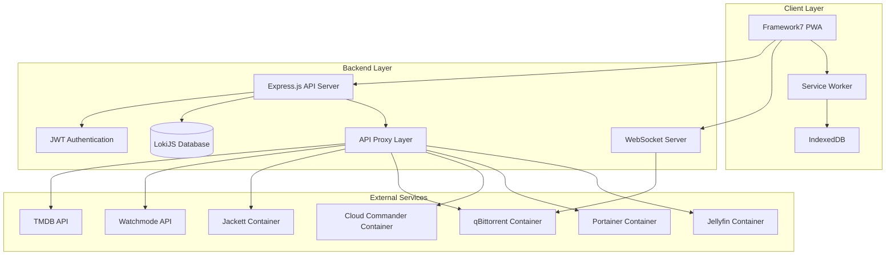
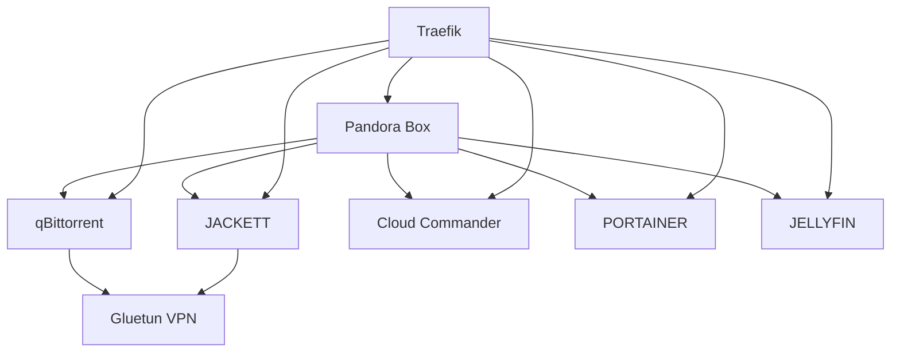

# Design Document

## Overview

Pandora is a comprehensive media management PWA that integrates multiple containerized services through a unified TypeScript backend and Framework7-based frontend. The architecture follows a proxy pattern where all external API communications are routed through the backend to ensure security, eliminate CORS issues, and centralize authentication and logging.

**Important Design Principles:**
- **Server-First Approach**: All implementation must first examine and understand the existing server codebase structure before making changes
- **Framework7 Documentation Compliance**: Follow https://framework7.io/docs/ for routing, templates, and component creation
- **Separation of Concerns**: Each functionality should have individual HTML, JS, and CSS files for maintainability
- **No Inline Templates**: Avoid adding template HTML code directly in JavaScript files

## Architecture

### High-Level Architecture



### Technology Stack

**Frontend:**
- Framework7 8.3+ for mobile-first UI components
- Vanilla JavaScript ES Modules (following Framework7 documentation patterns)
- Vite for build tooling and development
- PWA capabilities with service worker
- CSS Variables for theming (`--pb-` namespace)
- Separate HTML/JS/CSS files per component/page

**Backend (Existing Architecture):**
- Node.js 18+ with TypeScript (already implemented)
- Express.js REST API with comprehensive routing structure
- LokiJS embedded NoSQL database with full CRUD operations
- WebSocket service for real-time updates
- JWT authentication with session management
- Winston logging with structured logging
- API proxy service for external integrations
- Comprehensive middleware stack (auth, rate limiting, CORS, etc.)

**Infrastructure:**
- Docker Compose orchestration
- Traefik reverse proxy (optional)
- Volume persistence for data and logs

## Components and Interfaces

### Frontend Components

#### Core Application Structure (Framework7 Best Practices)
```
client/
├── index.html            # Main HTML entry point
├── src/
│   ├── js/
│   │   ├── app.js                    # Main Framework7 app initialization
│   │   ├── routes.js                 # Framework7 routing configuration
│   │   ├── store/                    # Application state management
│   │   │   ├── auth.js              # Authentication state
│   │   │   ├── media.js             # Media discovery state
│   │   │   ├── downloads.js         # Download management state
│   │   │   └── settings.js          # Application settings
│   │   ├── pages/                   # Framework7 page controllers (JS only)
│   │   │   ├── dashboard.js         # Media discovery dashboard logic
│   │   │   ├── downloads.js         # Download management logic
│   │   │   ├── files.js             # File manager logic
│   │   │   ├── containers.js        # Docker management logic
│   │   │   ├── jellyfin.js          # Media server control logic
│   │   │   └── settings.js          # Settings and configuration logic
│   │   ├── components/              # Reusable UI component controllers
│   │   │   ├── media-card.js        # Media content card logic
│   │   │   ├── download-item.js     # Download progress item logic
│   │   │   ├── file-browser.js      # File system browser logic
│   │   │   └── container-status.js  # Container status indicator logic
│   │   ├── services/                # API communication layer
│   │   │   ├── api.js              # Base API client
│   │   │   ├── auth.js             # Authentication service
│   │   │   ├── media.js            # Media discovery API
│   │   │   ├── torrents.js         # Torrent management API
│   │   │   ├── files.js            # File operations API
│   │   │   ├── containers.js       # Container management API
│   │   │   └── jellyfin.js         # Jellyfin API
│   │   └── utils/                  # Utility functions
│   │       ├── storage.js          # IndexedDB operations
│   │       ├── websocket.js        # WebSocket client
│   │       └── theme.js            # Theme management
│   ├── pages/                      # Framework7 page templates (HTML only)
│   │   ├── dashboard.html          # Media discovery dashboard template
│   │   ├── downloads.html          # Download management template
│   │   ├── files.html              # File manager template
│   │   ├── containers.html         # Docker management template
│   │   ├── jellyfin.html           # Media server control template
│   │   └── settings.html           # Settings and configuration template
│   ├── components/                 # Reusable UI component templates
│   │   ├── media-card.html         # Media content card template
│   │   ├── download-item.html      # Download progress item template
│   │   ├── file-browser.html       # File system browser template
│   │   └── container-status.html   # Container status indicator template
│   └── css/
│       ├── app.css                 # Main application styles
│       ├── pages/                  # Page-specific styles
│       │   ├── dashboard.css       # Dashboard page styles
│       │   ├── downloads.css       # Downloads page styles
│       │   ├── files.css           # Files page styles
│       │   ├── containers.css      # Containers page styles
│       │   ├── jellyfin.css        # Jellyfin page styles
│       │   └── settings.css        # Settings page styles
│       ├── components/             # Component-specific styles
│       │   ├── media-card.css      # Media card component styles
│       │   ├── download-item.css   # Download item component styles
│       │   ├── file-browser.css    # File browser component styles
│       │   └── container-status.css # Container status component styles
│       └── themes/                 # Theme variations
│           ├── dark.css            # Dark theme
│           └── light.css           # Light theme
├── vite.config.js        # Vite configuration
└── package.json          # Frontend dependencies
```

#### Framework7 Implementation Patterns

**IMPORTANT**: All frontend development must follow Framework7 documentation patterns from https://framework7.io/docs/

**File Organization Pattern:**
- Each page/component must have separate HTML, JS, and CSS files
- No inline HTML templates in JavaScript files
- Use Framework7's routing system for navigation
- Follow Framework7's component lifecycle methods

**Page Structure Example:**
```
pages/dashboard/
├── dashboard.html    # Template only (no JavaScript)
├── dashboard.js      # Logic only (no HTML strings)
└── dashboard.css     # Styles only
```

**Framework7 Page Template Pattern (dashboard.html):**
```html
<template>
  <div class="page" data-name="dashboard">
    <div class="navbar">
      <div class="navbar-bg"></div>
      <div class="navbar-inner">
        <div class="title">Media Dashboard</div>
      </div>
    </div>
    <div class="page-content">
      <!-- Page content here -->
    </div>
  </div>
</template>
```

**Framework7 Page Controller Pattern (dashboard.js):**
```javascript
export default {
  path: '/dashboard/',
  componentUrl: './pages/dashboard.html',
  on: {
    pageInit(e, page) {
      // Page initialization logic
    },
    pageBeforeIn(e, page) {
      // Before page transition
    },
    pageAfterIn(e, page) {
      // After page transition
    }
  }
}
```

#### Key Frontend Interfaces

**API Client Interface:**
```javascript
class ApiClient {
  constructor(baseURL, authToken)
  async get(endpoint, params)
  async post(endpoint, data)
  async put(endpoint, data)
  async delete(endpoint)
  setAuthToken(token)
  handleError(error)
}
```

**WebSocket Client Interface:**
```javascript
class WebSocketClient {
  constructor(url, authToken)
  connect()
  disconnect()
  subscribe(channel, callback)
  unsubscribe(channel)
  send(message)
}
```

### Backend Components (Existing Implementation)

**IMPORTANT**: Before implementing any backend changes, developers MUST:
1. Read and understand the existing server codebase in `server/src/`
2. Examine current API endpoints and their implementations
3. Review the database schema and service layer architecture
4. Understand the existing middleware and authentication flow

#### Current Server Structure (✓ Fully Implemented)
```
server/src/
├── app.ts                # Express application setup (✓ Implemented)
├── config/
│   └── config.ts        # Comprehensive configuration management (✓ Implemented)
├── middleware/          # Express middleware
│   ├── auth.ts          # JWT authentication (✓ Implemented)
│   └── errorHandler.ts  # Error handling (✓ Implemented)
├── routes/              # API route handlers (✓ All Implemented)
│   ├── auth.ts          # Authentication endpoints
│   ├── media.ts         # Media discovery endpoints
│   ├── streaming.ts     # Streaming service endpoints
│   ├── downloads.ts     # Download management endpoints
│   ├── files.ts         # File operations endpoints
│   ├── docker.ts        # Container management endpoints
│   ├── jellyfin.ts      # Jellyfin control endpoints
│   ├── settings.ts      # Settings management endpoints
│   └── health.ts        # Health check endpoints
├── controllers/         # Business logic controllers (✓ All Implemented)
│   ├── auth.ts          # Authentication controller
│   ├── media.ts         # Media discovery controller
│   ├── qbittorrent.ts   # qBittorrent controller
│   ├── cloudcommander.ts # Cloud Commander controller
│   ├── portainer.ts     # Portainer controller
│   ├── jellyfin.ts      # Jellyfin controller
│   ├── streaming.ts     # Streaming services controller
│   └── torrent.ts       # Torrent management controller
├── services/            # Core services (✓ All Implemented)
│   ├── database.ts      # LokiJS database service with full CRUD
│   ├── apiProxy.ts      # API proxy service for external APIs
│   ├── websocket.ts     # WebSocket service for real-time updates
│   └── httpClient.ts    # HTTP client utilities
├── types/               # TypeScript type definitions (✓ Implemented)
│   └── database.ts      # Database schema types
└── utils/               # Utility functions (✓ Implemented)
    └── logger.ts        # Winston logger with structured logging
```

#### Existing API Endpoints (Must be used by frontend)

**Base URL**: `/api/v1`

**Authentication Endpoints** (`/auth`):
- `POST /login` - User authentication
- `POST /refresh` - Token refresh
- `POST /logout` - User logout
- `GET /verify` - Token verification
- `GET /profile` - Get user profile
- `PUT /profile` - Update user profile
- `PUT /password` - Change password
- `POST /register` - Register new user (admin only)
- `GET /users` - List all users (admin only)
- `DELETE /users/:userId` - Delete user (admin only)

**Media Discovery Endpoints** (`/media`):
- `GET /trending/:type/:timeWindow` - Get trending content
- `GET /popular/:type` - Get popular content
- `GET /top-rated/:type` - Get top rated content
- `GET /search` - Search media content
- `GET /:type/:id` - Get content details
- `GET /genres/:type` - Get genres list
- `DELETE /cache` - Clear media cache
- `GET /cache/stats` - Get cache statistics

**Download Management Endpoints** (`/downloads`):
- `GET /` - List all torrents
- `GET /transfer-info` - Get transfer information
- `GET /preferences` - Get qBittorrent preferences
- `GET /:hash/details` - Get torrent details
- `GET /search-torrents` - Search torrents via Jackett
- `GET /indexers` - Get available indexers
- `GET /categories` - Get torrent categories
- `GET /search-history` - Get search history
- `DELETE /search-history` - Clear search history
- `POST /add` - Add new torrent
- `POST /:hash/control` - Control torrent (pause/resume/delete)

**Additional Endpoints Available**:
- `/files` - File management operations
- `/docker` - Container management
- `/jellyfin` - Jellyfin media server control
- `/streaming` - Streaming service integration
- `/settings` - Application settings management
- `/health` - Health check endpoints

#### Key Backend Interfaces

**Service Interface Pattern:**
```typescript
interface BaseService {
  initialize(): Promise<void>
  healthCheck(): Promise<boolean>
  getStatus(): ServiceStatus
}

interface MediaService extends BaseService {
  searchMovies(query: string): Promise<Movie[]>
  searchTVShows(query: string): Promise<TVShow[]>
  getTrending(type: 'movie' | 'tv'): Promise<MediaItem[]>
  getDetails(id: string, type: 'movie' | 'tv'): Promise<MediaDetails>
}
```

**Proxy Interface Pattern:**
```typescript
interface ApiProxy {
  baseURL: string
  apiKey?: string
  timeout: number
  
  get<T>(endpoint: string, params?: any): Promise<T>
  post<T>(endpoint: string, data?: any): Promise<T>
  handleError(error: any): never
}
```

## Data Models

### LokiJS Database Schema

#### Collections Structure
```typescript
// Users Collection
interface User {
  $loki?: number
  id: string
  username: string
  passwordHash: string
  role: 'admin' | 'team'
  createdAt: Date
  lastLogin?: Date
  settings: UserSettings
}

// Sessions Collection
interface Session {
  $loki?: number
  id: string
  userId: string
  token: string
  expiresAt: Date
  createdAt: Date
  lastAccessed: Date
  userAgent?: string
  ipAddress?: string
}

// Downloads Collection
interface Download {
  $loki?: number
  id: string
  userId: string
  magnetUri: string
  name: string
  size: number
  status: 'queued' | 'downloading' | 'completed' | 'failed' | 'paused'
  progress: number
  downloadSpeed: number
  uploadSpeed: number
  eta: number
  addedAt: Date
  completedAt?: Date
  trackers: string[]
  category?: string
  savePath: string
}

// FileOperations Collection
interface FileOperation {
  $loki?: number
  id: string
  userId: string
  operation: 'move' | 'copy' | 'delete' | 'rename'
  sourcePath: string
  destinationPath?: string
  status: 'pending' | 'completed' | 'failed'
  error?: string
  timestamp: Date
}

// Settings Collection
interface AppSettings {
  $loki?: number
  id: string
  category: string
  key: string
  value: any
  encrypted: boolean
  updatedAt: Date
  updatedBy: string
}

// MediaCache Collection (for TMDB/Watchmode data)
interface MediaCache {
  $loki?: number
  id: string
  type: 'movie' | 'tv'
  externalId: string
  source: 'tmdb' | 'watchmode'
  data: any
  cachedAt: Date
  expiresAt: Date
}
```

### API Response Models

#### Media Discovery Models
```typescript
interface MediaItem {
  id: string
  title: string
  overview: string
  posterPath?: string
  backdropPath?: string
  releaseDate: string
  voteAverage: number
  voteCount: number
  genres: Genre[]
  cast?: CastMember[]
  streamingAvailability?: StreamingProvider[]
}

interface TorrentResult {
  title: string
  magnetUri: string
  size: number
  seeders: number
  leechers: number
  tracker: string
  category: string
  publishDate: Date
  quality?: string
}
```

## Error Handling

### Frontend Error Handling Strategy

**Global Error Handler:**
```javascript
class ErrorHandler {
  static handle(error, context) {
    // Log error
    console.error(`Error in ${context}:`, error)
    
    // Show user-friendly message
    if (error.status === 401) {
      this.handleAuthError()
    } else if (error.status >= 500) {
      this.showServerError()
    } else {
      this.showGenericError(error.message)
    }
  }
  
  static handleAuthError() {
    // Clear stored tokens and redirect to login
    AuthService.logout()
    app.views.main.router.navigate('/login/')
  }
}
```

### Backend Error Handling Strategy

**Centralized Error Middleware:**
```typescript
interface ApiError extends Error {
  status: number
  code: string
  details?: any
}

const errorHandler = (error: ApiError, req: Request, res: Response, next: NextFunction) => {
  logger.error('API Error:', {
    error: error.message,
    stack: error.stack,
    url: req.url,
    method: req.method,
    userId: req.user?.id
  })
  
  const response = {
    error: true,
    message: error.message,
    code: error.code,
    ...(process.env.NODE_ENV === 'development' && { stack: error.stack })
  }
  
  res.status(error.status || 500).json(response)
}
```

## Development Workflow

### Pre-Implementation Requirements

**CRITICAL**: Before implementing any feature, developers MUST:

1. **Examine Existing Server Code**:
   - Read relevant controller files in `server/src/controllers/`
   - Understand existing API endpoints in `server/src/routes/`
   - Review database models in `server/src/types/database.ts`
   - Check existing services in `server/src/services/`

2. **Follow Framework7 Documentation**:
   - Reference https://framework7.io/docs/ for all frontend patterns
   - Use Framework7's routing system: https://framework7.io/docs/routes
   - Follow component creation patterns: https://framework7.io/docs/page
   - Implement proper page lifecycle: https://framework7.io/docs/page#page-events
   - Dont use Service worker

3. **File Organization Standards**:
   - Create separate HTML, JS, and CSS files for each component/page
   - Never embed HTML templates in JavaScript strings
   - Use Framework7's `componentUrl` for loading templates
   - Follow the established directory structure

### Implementation Process

1. **API Integration**: Use existing endpoints documented above
2. **Component Creation**: Follow Framework7 component patterns
3. **State Management**: Implement using Framework7's store or custom state management
4. **Styling**: Use Framework7's CSS variables and theming system
5. **Testing**: Test against existing backend services

### Code Quality Standards

- **Separation of Concerns**: Logic, templates, and styles in separate files
- **Framework7 Compliance**: All UI components must use Framework7 patterns
- **API Consistency**: Use existing backend endpoints without modification
- **Documentation**: Comment complex logic and API integrations

## Testing Strategy

### Frontend Testing

**Unit Tests:**
- Component rendering and behavior
- Service layer API calls
- Utility function logic
- State management operations

**Integration Tests:**
- Page navigation flows
- API integration with mock responses
- WebSocket connection handling
- PWA functionality (service worker, offline mode)

**E2E Tests:**
- Complete user workflows
- Authentication flows
- Media discovery and download processes
- File management operations

### Backend Testing

**Unit Tests:**
- Service layer business logic
- Proxy layer API calls with mocks
- Database operations with test database
- Authentication and authorization logic

**Integration Tests:**
- API endpoint responses
- Database persistence
- External service integration
- WebSocket message handling

**Load Tests:**
- API performance under concurrent requests
- Database query performance
- WebSocket connection limits
- Memory usage with large datasets

### Testing Tools and Configuration

**Frontend:**
- Vitest for unit and integration tests
- Playwright for E2E testing
- Mock Service Worker for API mocking

**Backend:**
- Vitest for unit and integration tests
- Supertest for API endpoint testing
- Docker containers for integration test environment

## Security Considerations

### Authentication and Authorization

**JWT Token Management:**
- Secure token generation with strong secrets
- Token refresh mechanism for long-lived sessions
- Automatic token cleanup on logout
- Rate limiting on authentication endpoints

**Role-Based Access Control:**
```typescript
enum Permission {
  READ_MEDIA = 'read:media',
  DOWNLOAD_TORRENTS = 'download:torrents',
  MANAGE_FILES = 'manage:files',
  CONTROL_CONTAINERS = 'control:containers',
  MANAGE_USERS = 'manage:users',
  CONFIGURE_SETTINGS = 'configure:settings'
}

const rolePermissions = {
  admin: Object.values(Permission),
  team: [
    Permission.READ_MEDIA,
    Permission.DOWNLOAD_TORRENTS,
    Permission.MANAGE_FILES
  ]
}
```

### Data Protection

**Encryption at Rest:**
- Sensitive settings encrypted in LokiJS
- API keys stored with AES-256 encryption
- User passwords hashed with bcrypt

**Network Security:**
- HTTPS enforcement in production
- CORS configuration for allowed origins
- Request validation and sanitization
- Rate limiting to prevent abuse

### API Security

**Proxy Layer Security:**
- API key validation before proxy requests
- Request/response sanitization
- Timeout handling for external services
- Circuit breaker pattern for failing services

## Performance Optimization

### Frontend Optimization

**Bundle Optimization:**
- Code splitting by route
- Lazy loading of non-critical components
- Tree shaking of unused Framework7 components
- Service worker caching strategy

**Runtime Optimization:**
- Virtual scrolling for large lists
- Image lazy loading and optimization
- Debounced search inputs
- Efficient state updates

### Backend Optimization

**Database Optimization:**
- LokiJS indexing for frequent queries
- Connection pooling for external APIs
- Caching layer for expensive operations
- Background job processing for file operations

**API Optimization:**
- Response compression
- Request/response caching
- Batch operations where possible
- Streaming for large file operations

## Deployment Architecture

### Container Orchestration

**Service Dependencies:**


**Volume Management:**
- Persistent volumes for application data
- Shared volumes for media files
- Backup strategies for critical data
- Log rotation and management

### Environment Configuration

**Production Environment:**
- HTTPS with Let's Encrypt certificates
- Reverse proxy with Traefik
- Container health checks and restart policies
- Resource limits and monitoring

**Development Environment:**
- Hot reload for both frontend and backend
- Development database with sample data
- Mock external services for testing
- Debug logging and error reporting