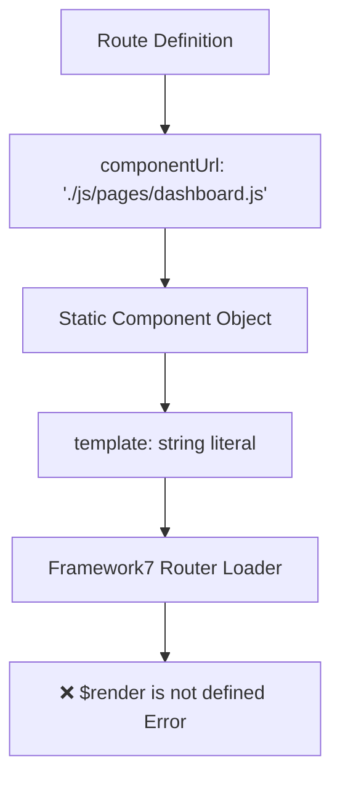
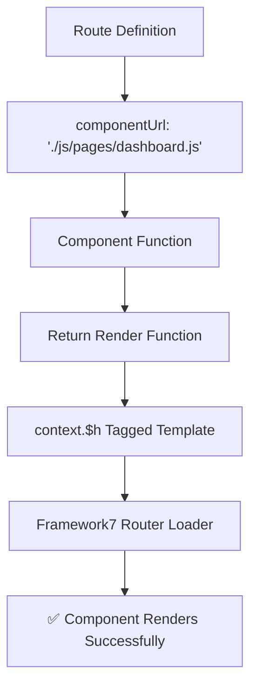
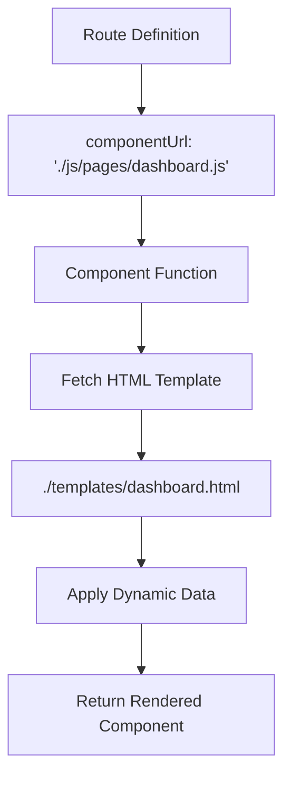

# Framework7 Routing Fix Design Document

## Overview

This design document addresses the critical Framework7 routing error where page components fail to load with the error "ReferenceError: $render is not defined". The issue stems from using incompatible component structures with Framework7's routing system and template rendering engine.

**Root Cause**: The current implementation uses static template strings in component objects with `componentUrl` routing, but Framework7 expects components to use the special `$h` tagged template literal or return render functions when using componentUrl.

**Impact**: 
- Application fails to navigate between pages
- Users cannot access any routes except the initial page
- Complete breakdown of the SPA routing functionality

## Technology Stack Analysis

**Current Implementation**:
- Framework7 8.x with full bundle (not lite)
- Vite for build tooling
- ComponentUrl-based routing
- Static template objects

**Requirements for Fix**:
- Maintain Framework7 8.x compatibility
- Preserve existing functionality
- Ensure proper component lifecycle management
- Support route guards and authentication

## Architecture

### Current Component Structure (Problematic)



### Fixed Component Structure (Solution)



## Component Architecture Redesign

### New Component Function Pattern

Framework7 components using `componentUrl` must follow this pattern:

```javascript
// Component Function Structure
const ComponentName = (props, context) => {
  // Component logic and state
  const { $h, $f7, $onMounted, $onBeforeUnmount } = context;
  
  // Component state and methods
  const componentState = {
    // data properties
  };
  
  const componentMethods = {
    // component methods
  };
  
  // Lifecycle hooks
  $onMounted(() => {
    // initialization logic
  });
  
  $onBeforeUnmount(() => {
    // cleanup logic
  });
  
  // Return render function with $h tagged template
  return () => $h`
    <div class="page">
      <!-- Component HTML -->
    </div>
  `;
};

export default ComponentName;
```

### Template Conversion Requirements

**Current Problematic Pattern**:
```javascript
export default {
  template: `<div class="page">...</div>`,
  data() { return {}; },
  methods: {},
  on: { pageInit() {} }
}
```

**Required Pattern**:
```javascript
const Component = (props, { $h, $onMounted }) => {
  // Component logic
  $onMounted(() => {
    // Initialization
  });
  
  return () => $h`
    <div class="page">
      <!-- HTML content -->
    </div>
  `;
};

export default Component;
```

## Template Separation Strategy

### HTML Template Files Approach

To improve maintainability and align with Framework7 best practices, we can separate component logic from templates by using dedicated HTML files for templates. This approach offers several advantages:

1. **Better IDE Support**: HTML files provide better syntax highlighting and IntelliSense
2. **Easier Maintenance**: Separation of concerns between logic and presentation
3. **Framework7 Compatibility**: Reduces template complexity and potential $render errors
4. **Performance**: Static HTML files can be cached more effectively

### Component Structure with Separated Templates



### Template Loading Pattern

```javascript
// Component with external HTML template
const DashboardComponent = async (props, { $h, $f7, $onMounted }) => {
  // Load external HTML template
  const templateResponse = await fetch('./templates/dashboard.html');
  const templateHTML = await templateResponse.text();
  
  // Component state and logic
  let componentData = {
    stats: {},
    loading: true
  };
  
  $onMounted(async () => {
    // Initialize component
    await loadDashboardData();
    updateUI();
  });
  
  const loadDashboardData = async () => {
    // Component logic
  };
  
  const updateUI = () => {
    // Update DOM elements with current data
    const statsEl = document.querySelector('#active-downloads');
    if (statsEl) {
      statsEl.textContent = componentData.stats.activeDownloads || '-';
    }
  };
  
  // Return template with $h wrapper
  return () => $h`${templateHTML}`;
};

export default DashboardComponent;
```

### Directory Structure for Separated Templates

```
client/
├── src/
│   ├── js/
│   │   ├── pages/
│   │   │   ├── dashboard.js      # Component logic only
│   │   │   ├── login.js          # Component logic only
│   │   │   └── search.js         # Component logic only
│   │   └── services/
│   ├── templates/                # New templates directory
│   │   ├── dashboard.html        # Pure HTML template
│   │   ├── login.html           # Pure HTML template
│   │   ├── search.html          # Pure HTML template
│   │   └── components/          # Reusable component templates
│   │       ├── stats-card.html
│   │       ├── media-item.html
│   │       └── download-item.html
│   └── css/
```

### Template File Examples

**dashboard.html** (Pure HTML Template):
```html
<div class="page" data-name="dashboard">
  <div class="navbar">
    <div class="navbar-bg"></div>
    <div class="navbar-inner sliding">
      <div class="left">
        <a href="#" class="link panel-open" data-panel="left">
          <i class="f7-icons">menu</i>
        </a>
      </div>
      <div class="title">Pandora Box</div>
      <div class="right">
        <a href="/search/" class="link">
          <i class="f7-icons">search</i>
        </a>
      </div>
    </div>
  </div>

  <div class="page-content">
    <!-- Quick Stats -->
    <div class="block-title">Quick Stats</div>
    <div class="block">
      <div class="row">
        <div class="col-25">
          <div class="card stats-card">
            <div class="card-content card-content-padding">
              <div class="stats-number" id="active-downloads">-</div>
              <div class="stats-label">Active Downloads</div>
            </div>
          </div>
        </div>
        <!-- Additional stats cards -->
      </div>
    </div>

    <!-- Dynamic content containers -->
    <div class="block-title">Trending Movies</div>
    <div class="block">
      <div class="row" id="trending-movies">
        <div class="col-100">
          <div class="preloader"></div>
          <p class="text-align-center">Loading trending movies...</p>
        </div>
      </div>
    </div>

    <!-- Quick Actions -->
    <div class="block-title">Quick Actions</div>
    <div class="block">
      <div class="row">
        <div class="col-50">
          <a href="/torrent-search/" class="button button-fill color-red">
            <i class="f7-icons">search</i> Search Torrents
          </a>
        </div>
        <div class="col-50">
          <a href="/files/" class="button button-fill color-blue">
            <i class="f7-icons">folder</i> Manage Files
          </a>
        </div>
      </div>
    </div>
  </div>
</div>
```

**dashboard.js** (Logic Only):
```javascript
import { apiService } from '../services/api.js';
import websocketService from '../services/websocket.js';

const DashboardComponent = async (props, { $h, $f7, $onMounted, $onBeforeUnmount }) => {
  // Load template
  const templateResponse = await fetch('./templates/dashboard.html');
  const templateHTML = await templateResponse.text();
  
  // Component state
  let componentData = {
    trendingMovies: [],
    trendingTV: [],
    recentDownloads: [],
    stats: {
      activeDownloads: 0,
      libraryItems: 0,
      runningContainers: 0,
      diskUsage: '0%'
    }
  };
  
  let wsSubscriptions = [];
  
  $onMounted(async () => {
    console.log('Dashboard page initialized');
    await loadDashboardData();
    setupWebSocketListeners();
    setupEventListeners();
  });
  
  $onBeforeUnmount(() => {
    cleanupWebSocketListeners();
  });
  
  // Component methods
  const loadDashboardData = async () => {
    try {
      await Promise.all([
        loadStats(),
        loadTrendingMovies(),
        loadTrendingTV(),
        loadRecentDownloads()
      ]);
    } catch (error) {
      console.error('Error loading dashboard data:', error);
      $f7.dialog.alert('Failed to load dashboard data');
    }
  };
  
  const loadStats = async () => {
    try {
      const downloadsResponse = await apiService.get('/downloads');
      const activeDownloads = downloadsResponse.success ? 
        downloadsResponse.data.torrents.filter(t => t.status === 'downloading').length : 0;
      
      componentData.stats.activeDownloads = activeDownloads;
      updateStatsUI();
    } catch (error) {
      console.error('Error loading stats:', error);
    }
  };
  
  const updateStatsUI = () => {
    const activeDownloadsEl = document.querySelector('#active-downloads');
    if (activeDownloadsEl) {
      activeDownloadsEl.textContent = componentData.stats.activeDownloads;
    }
    // Update other stats elements
  };
  
  const setupWebSocketListeners = () => {
    const downloadListener = websocketService.on('download:progress', handleDownloadProgress);
    const statusListener = websocketService.on('status:update', handleStatusUpdate);
    wsSubscriptions.push(downloadListener, statusListener);
  };
  
  const cleanupWebSocketListeners = () => {
    wsSubscriptions.forEach(unsubscribe => unsubscribe());
    wsSubscriptions = [];
  };
  
  const handleDownloadProgress = (data) => {
    // Update download progress in UI
  };
  
  const setupEventListeners = () => {
    // Setup DOM event listeners after template is loaded
    setTimeout(() => {
      const scanButton = document.querySelector('#scan-library');
      if (scanButton) {
        scanButton.addEventListener('click', handleScanLibrary);
      }
    }, 100);
  };
  
  const handleScanLibrary = async () => {
    try {
      $f7.preloader.show('Scanning library...');
      await apiService.post('/jellyfin/scan');
      $f7.toast.create({
        text: 'Library scan started',
        closeTimeout: 3000
      }).open();
    } catch (error) {
      $f7.dialog.alert('Failed to start library scan');
    } finally {
      $f7.preloader.hide();
    }
  };
  
  // Return template wrapped in $h
  return () => $h`${templateHTML}`;
};

export default DashboardComponent;
```

### Template Caching Strategy

```javascript
// Template cache utility
class TemplateCache {
  constructor() {
    this.cache = new Map();
  }
  
  async getTemplate(path) {
    if (this.cache.has(path)) {
      return this.cache.get(path);
    }
    
    const response = await fetch(path);
    const html = await response.text();
    this.cache.set(path, html);
    return html;
  }
  
  clearCache() {
    this.cache.clear();
  }
}

// Global template cache instance
const templateCache = new TemplateCache();

// Usage in components
const Component = async (props, { $h }) => {
  const templateHTML = await templateCache.getTemplate('./templates/component.html');
  return () => $h`${templateHTML}`;
};
```

### Vite Configuration for Template Files

```javascript
// vite.config.js updates
export default defineConfig({
  // ... existing config
  assetsInclude: ['**/*.html'], // Include HTML files as assets
  build: {
    rollupOptions: {
      input: {
        main: resolve(__dirname, 'src/index.html'),
        // Include template files
        templates: resolve(__dirname, 'src/templates/**/*.html')
      }
    }
  },
  server: {
    // Serve template files
    fs: {
      allow: ['..', 'src/templates']
    }
  }
});
```

## Implementation Strategy

### Phase 1: Core Infrastructure Update

1. **Update Route Configuration**
   - Verify `componentUrl` paths are correct
   - Ensure consistent path resolution
   - Maintain route guards functionality

2. **Component Function Conversion**
   - Convert all page components to function-based structure
   - Implement proper lifecycle management
   - Preserve existing component logic

3. **Template Migration**
   - Convert template strings to `$h` tagged templates
   - Handle dynamic content rendering
   - Ensure proper variable interpolation

### Phase 2: Template Separation Implementation

1. **Create Templates Directory Structure**
   - Create `src/templates/` directory
   - Create subdirectories for components and pages
   - Organize templates by feature area

2. **Extract HTML Templates**
   - Extract template strings from JavaScript components
   - Create corresponding HTML files
   - Clean up template syntax for pure HTML

3. **Update Component Loading**
   - Implement template loading utility
   - Add template caching mechanism
   - Update Vite configuration for template serving

### Phase 3: Component-Specific Fixes

1. **Dashboard Component**
   - Separate dashboard.html template
   - Convert to component function with template loading
   - Migrate API calls to lifecycle hooks
   - Implement proper DOM manipulation for dynamic content

2. **Authentication Components**
   - Create login.html template
   - Maintain route guard compatibility
   - Preserve authentication flow
   - Update navigation logic with template separation

3. **Dynamic Route Components**
   - Create media-details.html template
   - Handle route parameters properly
   - Maintain media details functionality
   - Preserve search and filtering with separated templates

### Phase 4: Testing and Validation

1. **Route Navigation Testing**
   - Test all route transitions
   - Verify back/forward navigation
   - Validate deep linking

2. **Component Lifecycle Testing**
   - Test component mounting/unmounting
   - Verify proper cleanup
   - Test WebSocket connections

3. **Authentication Flow Testing**
   - Test route guards
   - Verify protected routes
   - Test login/logout flows

## Routing & Navigation Updates

### Route Configuration Enhancement

```javascript
// Enhanced route structure with proper error handling
export const routes = [
  {
    path: '/',
    componentUrl: './js/pages/dashboard.js',
    options: {
      transition: 'f7-cover'
    },
    beforeEnter: (routeTo, routeFrom, resolve, reject) => {
      // Route validation logic
      resolve();
    }
  },
  // Additional routes...
];
```

### Route Guard Improvements

```javascript
// Enhanced route guard with better error handling
export function isProtectedRoute(path) {
  return routeGuards.requiresAuth.some(route => {
    if (route.endsWith('/')) {
      return path.startsWith(route);
    }
    return path === route || path.startsWith(route + '/');
  });
}
```

## Component Lifecycle Management

### Mounting and Unmounting

```javascript
const Component = (props, { $h, $onMounted, $onBeforeUnmount, $f7 }) => {
  let websocketListeners = [];
  let intervalIds = [];
  
  $onMounted(() => {
    // Initialize component
    setupEventListeners();
    startPeriodicUpdates();
    connectWebSocket();
  });
  
  $onBeforeUnmount(() => {
    // Cleanup resources
    cleanupEventListeners();
    clearIntervals();
    disconnectWebSocket();
  });
  
  const setupEventListeners = () => {
    // Setup DOM event listeners
  };
  
  const cleanupEventListeners = () => {
    // Remove event listeners
  };
  
  return () => $h`
    <div class="page">
      <!-- Component template -->
    </div>
  `;
};
```

### State Management Pattern

```javascript
const Component = (props, { $h, $useState, $f7 }) => {
  // Reactive state using Framework7's state management
  const { state: componentData, update: updateData } = $useState({
    loading: true,
    items: [],
    error: null
  });
  
  const loadData = async () => {
    try {
      updateData({ loading: true, error: null });
      const response = await apiService.get('/data');
      updateData({ 
        loading: false, 
        items: response.data,
        error: null 
      });
    } catch (error) {
      updateData({ 
        loading: false, 
        error: error.message 
      });
    }
  };
  
  return () => $h`
    <div class="page">
      ${componentData.loading ? $h`
        <div class="preloader"></div>
      ` : ''}
      
      ${componentData.error ? $h`
        <div class="block">
          <p class="text-color-red">${componentData.error}</p>
        </div>
      ` : ''}
      
      ${componentData.items.map(item => $h`
        <div class="item">${item.name}</div>
      `)}
    </div>
  `;
};
```

## API Integration Layer Updates

### Service Integration Pattern

```javascript
const Component = (props, { $h, $onMounted, $f7 }) => {
  let apiData = {};
  
  $onMounted(async () => {
    try {
      $f7.preloader.show('Loading...');
      
      // Load data from multiple APIs
      const [stats, downloads, media] = await Promise.all([
        apiService.get('/stats'),
        apiService.get('/downloads'),
        apiService.get('/media/trending')
      ]);
      
      apiData = {
        stats: stats.data,
        downloads: downloads.data,
        media: media.data
      };
      
      // Update UI
      updateDashboard();
      
    } catch (error) {
      $f7.dialog.alert('Failed to load data: ' + error.message);
    } finally {
      $f7.preloader.hide();
    }
  });
  
  const updateDashboard = () => {
    // Update dashboard with loaded data
  };
  
  return () => $h`
    <div class="page">
      <!-- Dashboard content -->
    </div>
  `;
};
```

## WebSocket Integration Updates

### Component WebSocket Management

```javascript
const Component = (props, { $h, $onMounted, $onBeforeUnmount }) => {
  let wsSubscriptions = [];
  
  $onMounted(() => {
    // Setup WebSocket listeners
    const downloadListener = websocketService.on('download:progress', handleDownloadProgress);
    const statusListener = websocketService.on('status:update', handleStatusUpdate);
    
    wsSubscriptions.push(downloadListener, statusListener);
  });
  
  $onBeforeUnmount(() => {
    // Cleanup WebSocket listeners
    wsSubscriptions.forEach(unsubscribe => unsubscribe());
    wsSubscriptions = [];
  });
  
  const handleDownloadProgress = (data) => {
    // Handle real-time download updates
  };
  
  const handleStatusUpdate = (data) => {
    // Handle real-time status updates
  };
  
  return () => $h`
    <div class="page">
      <!-- Component with real-time updates -->
    </div>
  `;
};
```

## Error Handling Strategy

### Component Error Boundaries

```javascript
const Component = (props, { $h, $f7 }) => {
  const handleError = (error, context = 'Component') => {
    console.error(`${context} Error:`, error);
    
    $f7.dialog.alert({
      title: 'Error',
      text: `${context} failed: ${error.message}`,
      buttons: [{
        text: 'Retry',
        onClick: () => window.location.reload()
      }, {
        text: 'Continue',
        onClick: () => $f7.view.main.router.back()
      }]
    });
  };
  
  const safeAsyncOperation = async (operation, context) => {
    try {
      return await operation();
    } catch (error) {
      handleError(error, context);
      return null;
    }
  };
  
  return () => $h`
    <div class="page">
      <!-- Error-safe component -->
    </div>
  `;
};
```

### Route-Level Error Handling

```javascript
// Enhanced app.js pageBeforeIn with better error handling
on: {
  pageBeforeIn: async function (page) {
    try {
      const path = page.route.path;
      
      if (isProtectedRoute(path)) {
        const isValid = await authService.verifyToken();
        if (!isValid) {
          this.view.main.router.navigate('/login/', {
            clearPreviousHistory: true
          });
          return false;
        }
        
        if (isAdminRoute(path)) {
          const user = authService.getCurrentUser();
          if (!user || user.role !== 'admin') {
            this.methods.showError('Access denied. Admin privileges required.');
            this.view.main.router.back();
            return false;
          }
        }
      }
    } catch (error) {
      console.error('Route guard error:', error);
      this.methods.showError('Navigation failed. Please try again.');
      return false;
    }
  }
}
```

## Performance Optimization

### Lazy Loading Enhancement

```javascript
// Optimized route configuration with preloading
export const routes = [
  {
    path: '/',
    componentUrl: './js/pages/dashboard.js',
    options: {
      transition: 'f7-cover',
      preloadPrevious: false,
      reloadCurrent: false
    }
  },
  {
    path: '/search/',
    componentUrl: './js/pages/search.js',
    options: {
      transition: 'f7-push',
      preloadPrevious: true // Preload for back navigation
    }
  }
];
```

### Component Caching Strategy

```javascript
const Component = (props, { $h, $onMounted }) => {
  // Cache expensive operations
  const memoizedData = new Map();
  
  const getCachedData = async (key, fetcher) => {
    if (memoizedData.has(key)) {
      return memoizedData.get(key);
    }
    
    const data = await fetcher();
    memoizedData.set(key, data);
    return data;
  };
  
  return () => $h`
    <div class="page">
      <!-- Optimized component -->
    </div>
  `;
};
```

## Template Management Best Practices

### Template Naming Conventions

```
templates/
├── pages/                    # Main page templates
│   ├── dashboard.html
│   ├── login.html
│   ├── search.html
│   └── settings.html
├── components/               # Reusable component templates
│   ├── stats-card.html
│   ├── media-item.html
│   ├── download-item.html
│   └── navigation.html
├── layouts/                  # Layout templates
│   ├── main-layout.html
│   └── auth-layout.html
└── partials/                 # Template partials
    ├── loading-spinner.html
    ├── error-message.html
    └── empty-state.html
```

### Template Composition Strategy

```javascript
// Template composition utility
class TemplateComposer {
  constructor(templateCache) {
    this.cache = templateCache;
  }
  
  async composeTemplate(mainTemplate, partials = {}) {
    let html = await this.cache.getTemplate(mainTemplate);
    
    // Replace partials
    for (const [placeholder, templatePath] of Object.entries(partials)) {
      const partialHtml = await this.cache.getTemplate(templatePath);
      html = html.replace(`<!-- ${placeholder} -->`, partialHtml);
    }
    
    return html;
  }
}

// Usage in components
const DashboardComponent = async (props, { $h }) => {
  const composer = new TemplateComposer(templateCache);
  
  const templateHTML = await composer.composeTemplate(
    './templates/pages/dashboard.html',
    {
      'STATS_SECTION': './templates/components/stats-card.html',
      'MEDIA_GRID': './templates/components/media-grid.html'
    }
  );
  
  return () => $h`${templateHTML}`;
};
```

### Dynamic Content Injection

```javascript
// Template with placeholder system
const renderWithData = (template, data) => {
  return template.replace(/\{\{([^}]+)\}\}/g, (match, key) => {
    const value = key.split('.').reduce((obj, k) => obj?.[k], data);
    return value !== undefined ? value : match;
  });
};

// Usage
const Component = async (props, { $h }) => {
  const template = await templateCache.getTemplate('./templates/component.html');
  
  const data = {
    title: 'Dashboard',
    stats: {
      downloads: 5,
      files: 1250
    }
  };
  
  const renderedTemplate = renderWithData(template, data);
  return () => $h`${renderedTemplate}`;
};
```

### Template Hot Reloading in Development

```javascript
// Development template reloader
if (import.meta.env.DEV) {
  const templateWatcher = {
    watch(templatePath, callback) {
      // Watch template file for changes
      const eventSource = new EventSource(`/api/watch?file=${templatePath}`);
      eventSource.onmessage = (event) => {
        if (event.data === 'changed') {
          templateCache.cache.delete(templatePath);
          callback();
        }
      };
    }
  };
  
  // Auto-reload component when template changes
  templateWatcher.watch('./templates/dashboard.html', () => {
    window.location.reload();
  });
}
```

## Testing Strategy

### Template Testing

```javascript
// Template validation tests
describe('Template Files', () => {
  test('should have valid HTML structure', async () => {
    const template = await fs.readFile('./src/templates/dashboard.html', 'utf-8');
    
    // Validate HTML structure
    expect(template).toContain('<div class="page"');
    expect(template).toContain('</div>');
    
    // Check for required elements
    expect(template).toContain('id="active-downloads"');
    expect(template).toContain('class="navbar"');
  });
  
  test('should not contain JavaScript code', async () => {
    const template = await fs.readFile('./src/templates/dashboard.html', 'utf-8');
    
    // Ensure pure HTML
    expect(template).not.toContain('<script>');
    expect(template).not.toContain('function(');
    expect(template).not.toContain('async ');
  });
});
```

### Component Unit Testing

```javascript
// Component testing with Framework7 context mock
describe('Dashboard Component', () => {
  let mockContext;
  
  beforeEach(() => {
    mockContext = {
      $h: (template) => template,
      $f7: {
        dialog: { alert: jest.fn() },
        preloader: { show: jest.fn(), hide: jest.fn() }
      },
      $onMounted: jest.fn(),
      $onBeforeUnmount: jest.fn()
    };
  });
  
  test('should render dashboard template', () => {
    const Component = require('./dashboard.js').default;
    const renderFn = Component({}, mockContext);
    const template = renderFn();
    
    expect(template).toContain('class="page"');
    expect(template).toContain('Pandora Box');
  });
  
  test('should setup lifecycle hooks', () => {
    const Component = require('./dashboard.js').default;
    Component({}, mockContext);
    
    expect(mockContext.$onMounted).toHaveBeenCalled();
    expect(mockContext.$onBeforeUnmount).toHaveBeenCalled();
  });
});
```

### Integration Testing

```javascript
// Route navigation testing
describe('Route Navigation', () => {
  test('should navigate between pages without $render error', async () => {
    const app = new Framework7({
      root: '#app',
      routes: routes
    });
    
    // Test navigation
    await app.view.main.router.navigate('/dashboard/');
    expect(app.view.main.router.currentRoute.path).toBe('/dashboard/');
    
    await app.view.main.router.navigate('/search/');
    expect(app.view.main.router.currentRoute.path).toBe('/search/');
  });
});
```