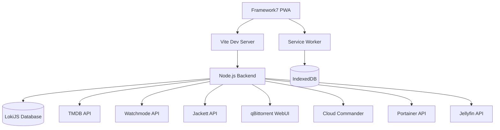
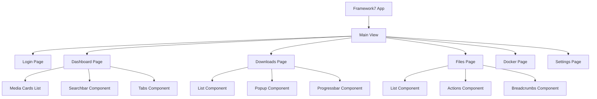
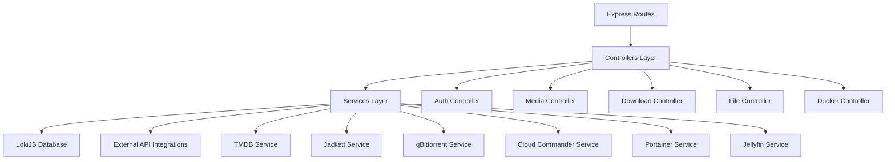
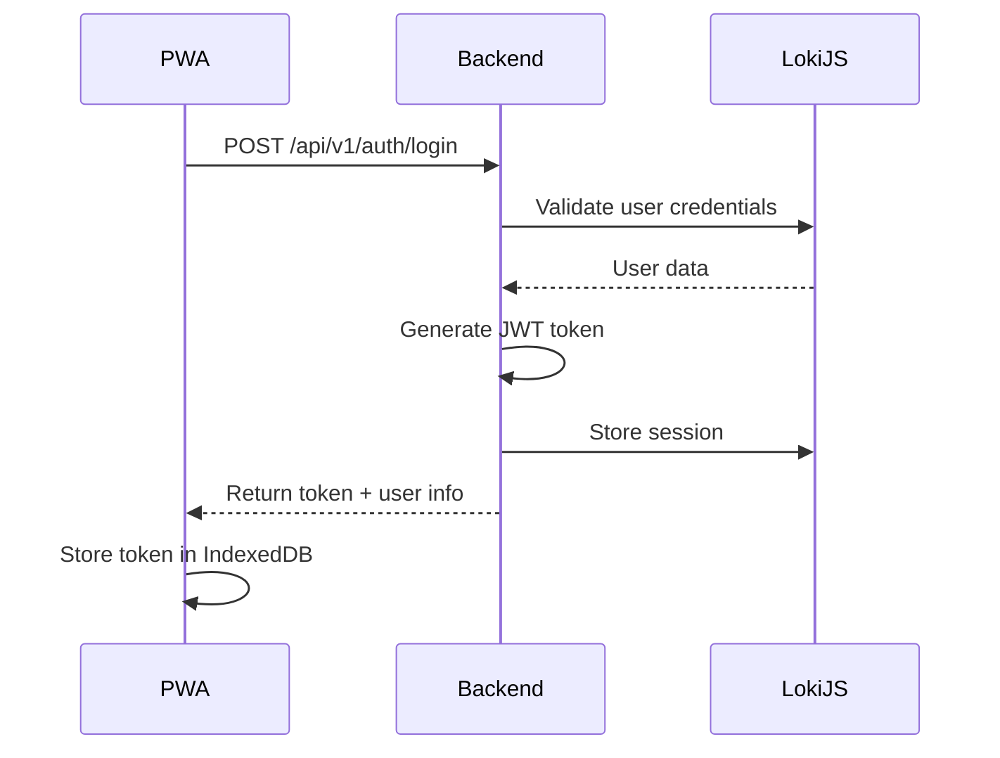
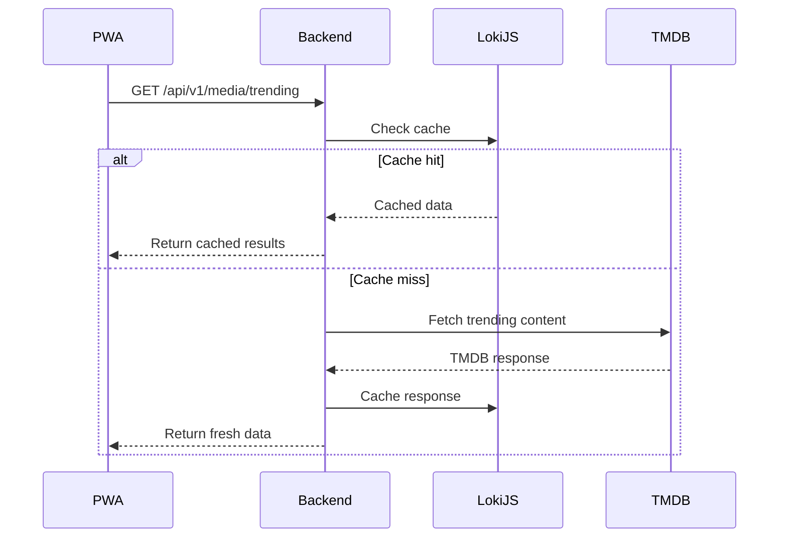
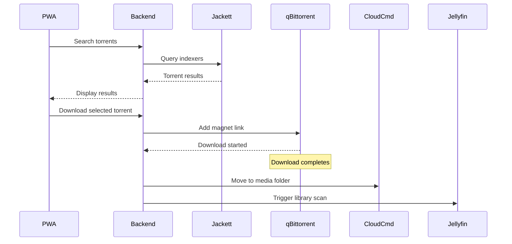
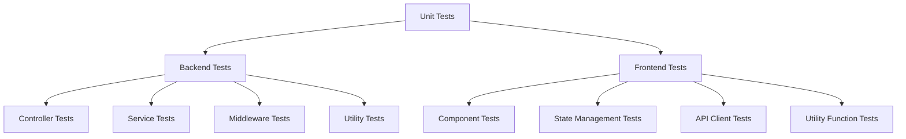

# Pandora Box PWA - Technical Design Specification

## Overview

Pandora Box is a self-hosted Progressive Web Application designed to unify media discovery, torrent downloads, file management, Docker orchestration, and Jellyfin server control into a single mobile-first interface. The application consolidates multiple Dockerized services into a Netflix-inspired dark-themed interface optimized for Raspberry Pi and home lab deployments.

## Technology Stack & Dependencies

### Frontend Stack
- **UI Framework**: Framework7 (Mobile-first UI framework)
- **Core**: Vanilla JavaScript (ES6+ modules), HTML5, CSS3
- **PWA Features**: Service Workers, Web App Manifest, IndexedDB
- **Styling**: Framework7 CSS framework with custom theming
- **Build Tools**: Vite (development and production)

### Backend Stack
- **Runtime**: Node.js 18+
- **Framework**: Express.js with TypeScript
- **Database**: LokiJS (embedded NoSQL)
- **Authentication**: JWT tokens with bcryptjs
- **HTTP Client**: Axios for API proxying
- **WebSocket**: ws library for real-time updates

### External Services Integration
| Service | Purpose | Authentication |
|---------|---------|----------------|
| TMDB | Movie/TV metadata | API Key |
| Watchmode | Streaming availability | API Key |
| Jackett | Torrent indexing | API Key |
| qBittorrent | Download management | Basic Auth |
| Cloud Commander | File operations | Basic Auth |
| Portainer | Container management | API Token |
| Jellyfin | Media server control | API Key |

## Project Structure

### Root Directory Layout
```
pandora-box/
├── client/                     # Frontend Framework7 application
│   ├── src/
│   │   ├── js/                 # JavaScript modules
│   │   │   ├── app.js          # Main app initialization
│   │   │   ├── routes.js       # Framework7 routing
│   │   │   ├── pages/          # Page components
│   │   │   ├── components/     # Reusable components
│   │   │   └── services/       # API services
│   │   ├── css/               # Stylesheets
│   │   │   ├── app.css        # Custom styles
│   │   │   └── themes/        # Theme variations
│   │   ├── pages/             # HTML page templates
│   │   └── assets/            # Images, icons, fonts
│   ├── public/                # Static files
│   │   ├── index.html         # Main HTML file
│   │   ├── manifest.json      # PWA manifest
│   │   └── sw.js             # Service worker
│   ├── vite.config.js         # Vite configuration
│   └── package.json           # Frontend dependencies
├── server/                     # Backend Node.js application
│   ├── src/                   # TypeScript source code
│   │   ├── controllers/       # Route controllers
│   │   ├── services/          # External API services
│   │   ├── middleware/        # Auth, validation
│   │   ├── routes/            # API route definitions
│   │   ├── types/             # TypeScript interfaces
│   │   ├── utils/             # Helper functions
│   │   └── app.ts             # Main server file
│   ├── dist/                  # Compiled JavaScript
│   ├── data/                  # LokiJS database files
│   ├── tsconfig.json          # TypeScript configuration
│   └── package.json           # Backend dependencies
├── docker/                     # Docker configuration
│   ├── Dockerfile             # Production container
│   └── docker-compose.yml     # Development services
├── package.json               # Root package.json with scripts
├── .env.example               # Environment template
└── README.md                  # Project documentation
```

## Component Architecture

### System Architecture Pattern


### Framework7 Application Structure

#### Framework7 App Configuration
```javascript
const app = new Framework7({
  name: 'Pandora Box',
  theme: 'auto',
  id: 'com.pandora.box',
  
  // PWA Configuration
  serviceWorker: {
    path: '/sw.js',
    scope: '/'
  },
  
  // Routes Configuration
  routes: [
    { path: '/', component: DashboardPage },
    { path: '/login/', component: LoginPage },
    { path: '/downloads/', component: DownloadsPage },
    { path: '/files/', component: FilesPage },
    { path: '/docker/', component: DockerPage },
    { path: '/settings/', component: SettingsPage }
  ],
  
  // Theme Configuration
  colors: {
    primary: '#e50914',
    surface: '#141414'
  }
});
```

#### Component Hierarchy


### Backend Service Layer Architecture


## Data Models & ORM Mapping

### LokiJS Collections Schema

#### Users Collection
```typescript
interface User {
  id: string;
  username: string;
  email: string;
  password: string; // bcrypt hashed
  role: 'admin' | 'team';
  createdAt: string;
  updatedAt: string;
}
```

#### Sessions Collection
```typescript
interface Session {
  id: string;
  userId: string;
  token: string;
  expiresAt: string;
  rememberMe: boolean;
  createdAt: string;
  lastAccessedAt: string;
}
```

#### Downloads Collection
```typescript
interface Download {
  id: string;
  userId: string;
  name: string;
  magnetUrl: string;
  status: 'downloading' | 'completed' | 'paused' | 'error';
  progress: number;
  speed: string;
  eta: string;
  size: string;
  seeders: number;
  leechers: number;
  category: 'movie' | 'tv';
  addedAt: string;
  completedAt?: string;
}
```

#### Settings Collection
```typescript
interface Setting {
  key: string;
  value: any;
  category: 'api' | 'user' | 'system' | 'theme';
  encrypted: boolean;
  userId?: string;
  updatedAt: string;
}
```

#### Media Cache Collection
```typescript
interface MediaCache {
  id: string;
  type: 'trending' | 'popular' | 'search' | 'details';
  category: string;
  data: any;
  expiresAt: string;
  createdAt: string;
}
```

## API Endpoints Reference

### Authentication Endpoints
| Method | Endpoint | Description | Auth Required |
|--------|----------|-------------|---------------|
| POST | `/api/v1/auth/login` | User login with credentials | No |
| POST | `/api/v1/auth/logout` | User logout | Yes |
| GET | `/api/v1/auth/verify` | Verify token validity | Yes |
| POST | `/api/v1/auth/refresh` | Refresh JWT token | Yes |
| PUT | `/api/v1/auth/password` | Change password | Yes |

### Media Discovery Endpoints
| Method | Endpoint | Description | Auth Required |
|--------|----------|-------------|---------------|
| GET | `/api/v1/media/trending` | Get trending content | Yes |
| GET | `/api/v1/media/popular` | Get popular content | Yes |
| GET | `/api/v1/media/search` | Search movies/TV shows | Yes |
| GET | `/api/v1/media/{type}/{id}` | Get detailed metadata | Yes |

### Download Management Endpoints
| Method | Endpoint | Description | Auth Required |
|--------|----------|-------------|---------------|
| POST | `/api/v1/torrents/search` | Search torrents via Jackett | Yes |
| POST | `/api/v1/torrents/download` | Add torrent to qBittorrent | Yes |
| GET | `/api/v1/downloads` | List active downloads | Yes |
| POST | `/api/v1/downloads/{id}/control` | Control download (pause/resume) | Yes |
| DELETE | `/api/v1/downloads/{id}` | Remove download | Yes |

### File Management Endpoints
| Method | Endpoint | Description | Auth Required |
|--------|----------|-------------|---------------|
| GET | `/api/v1/files/browse` | Browse Samba directories | Yes |
| POST | `/api/v1/files/move` | Move files between folders | Yes |
| POST | `/api/v1/files/create` | Create directory | Yes |
| DELETE | `/api/v1/files/{path}` | Delete file/folder | Yes |

### Container Management Endpoints
| Method | Endpoint | Description | Auth Required |
|--------|----------|-------------|---------------|
| GET | `/api/v1/containers` | List containers and stacks | Yes |
| POST | `/api/v1/containers/{id}/restart` | Restart container | Yes |
| GET | `/api/v1/containers/{id}/logs` | Get container logs | Yes |
| PUT | `/api/v1/stacks/arr/gluetun` | Change VPN country | Yes |

### Jellyfin Integration Endpoints
| Method | Endpoint | Description | Auth Required |
|--------|----------|-------------|---------------|
| POST | `/api/v1/jellyfin/scan/movies` | Trigger movie library scan | Yes |
| POST | `/api/v1/jellyfin/scan/tv` | Trigger TV library scan | Yes |
| GET | `/api/v1/jellyfin/status` | Get scan status | Yes |
| GET | `/api/v1/jellyfin/stats` | Get library statistics | Yes |

## Business Logic Layer Architecture

### Authentication Flow


### Media Discovery Workflow


### Download Pipeline Architecture


## Development & Build Configuration

### Package.json Scripts (Root)
```json
{
  "name": "pandora-box",
  "version": "1.0.0",
  "scripts": {
    "dev": "concurrently \"npm run dev:server\" \"npm run dev:client\"",
    "dev:server": "cd server && npm run dev",
    "dev:client": "cd client && npm run dev",
    "build": "npm run build:server && npm run build:client",
    "build:server": "cd server && npm run build",
    "build:client": "cd client && npm run build",
    "docker:build": "docker build -t pandora-box:latest .",
    "docker:run": "docker-compose up -d"
  },
  "devDependencies": {
    "concurrently": "^8.2.2"
  }
}
```

### Vite Configuration (client/vite.config.js)
```javascript
import { defineConfig } from 'vite';
import path from 'path';

export default defineConfig({
  root: './src',
  base: '/',
  publicDir: '../public',
  
  build: {
    outDir: '../dist',
    emptyOutDir: true,
    rollupOptions: {
      input: {
        main: path.resolve(__dirname, 'src/index.html')
      }
    }
  },
  
  server: {
    port: 3000,
    proxy: {
      '/api': {
        target: 'http://localhost:8080',
        changeOrigin: true,
        secure: false
      }
    }
  },
  
  resolve: {
    alias: {
      '@': path.resolve(__dirname, 'src')
    }
  }
});
```

## Routing & Navigation

### Framework7 Routing Configuration
```javascript
const routes = [
  {
    path: '/',
    component: DashboardPage,
    options: {
      transition: 'f7-cover'
    }
  },
  {
    path: '/login/',
    component: LoginPage,
    options: {
      transition: 'f7-fade'
    }
  },
  {
    path: '/downloads/',
    component: DownloadsPage,
    tabs: [
      { path: '/', id: 'active' },
      { path: '/history/', id: 'history' }
    ]
  },
  {
    path: '/files/',
    component: FilesPage,
    master: true,
    detailRoutes: [
      {
        path: '/files/folder/:path/',
        component: FolderDetailsPage
      }
    ]
  },
  {
    path: '/docker/',
    component: DockerPage,
    tabs: [
      { path: '/', id: 'containers' },
      { path: '/stacks/', id: 'stacks' }
    ]
  },
  {
    path: '/settings/',
    component: SettingsPage,
    routes: [
      { path: '/profile/', component: ProfilePage },
      { path: '/api/', component: ApiSettingsPage },
      { path: '/theme/', component: ThemeSettingsPage }
    ]
  }
];
```

### Route Protection
```typescript
interface RouteGuard {
  path: string;
  component: string;
  requiresAuth: boolean;
  roles?: ('admin' | 'team')[];
  redirectTo?: string;
}

const routes: RouteGuard[] = [
  { path: '/login', component: 'LoginComponent', requiresAuth: false },
  { path: '/dashboard', component: 'DashboardComponent', requiresAuth: true },
  { path: '/settings/api', component: 'ApiSettingsComponent', requiresAuth: true, roles: ['admin'] },
  // ... other routes
];
```

## Styling Strategy

### Framework7 Custom Theme Configuration
```css
/* client/src/css/app.css */

/* Framework7 Custom Theme Variables */
:root {
  /* Netflix-inspired Dark Theme for Framework7 */
  --f7-theme-color: #e50914;
  --f7-theme-color-rgb: 229, 9, 20;
  
  /* Dark theme colors */
  --f7-color-primary: #e50914;
  --f7-color-primary-rgb: 229, 9, 20;
  
  /* Surface colors */
  --f7-page-bg-color: #141414;
  --f7-bars-bg-color: #0f0f0f;
  --f7-navbar-bg-color: #0f0f0f;
  --f7-tabbar-bg-color: #0f0f0f;
  --f7-card-bg-color: #1f1f1f;
  --f7-popup-bg-color: #1f1f1f;
  --f7-sheet-bg-color: #1f1f1f;
  
  /* Text colors */
  --f7-text-color: #ffffff;
  --f7-bars-text-color: #ffffff;
  --f7-navbar-text-color: #ffffff;
  --f7-tabbar-text-color: #b3b3b3;
  --f7-list-item-text-color: #ffffff;
  
  /* Border colors */
  --f7-bars-border-color: #2a2a2a;
  --f7-tabbar-border-color: #2a2a2a;
  --f7-list-item-border-color: #2a2a2a;
  
  /* Custom app variables */
  --app-accent-color: #00d4ff;
  --app-success-color: #46d369;
  --app-warning-color: #ffa00a;
  --app-error-color: #f54747;
  --app-muted-text: #808080;
}

/* Framework7 Component Customizations */
.navbar {
  backdrop-filter: blur(10px);
  background: rgba(15, 15, 15, 0.9);
}

.card {
  border-radius: 12px;
  box-shadow: 0 4px 12px rgba(0, 0, 0, 0.3);
}

.list {
  background: transparent;
}

.item-content {
  background: var(--f7-card-bg-color);
  border-radius: 8px;
  margin-bottom: 8px;
}

/* Media card styling */
.media-card {
  background: linear-gradient(135deg, #1f1f1f, #2a2a2a);
  border-radius: 12px;
  overflow: hidden;
  transition: transform 0.3s ease;
}

.media-card:hover {
  transform: scale(1.05);
}

.media-poster {
  aspect-ratio: 2/3;
  object-fit: cover;
  border-radius: 8px;
}
```

### Framework7 Package Configuration
```json
// client/package.json
{
  "name": "pandora-box-client",
  "version": "1.0.0",
  "type": "module",
  "scripts": {
    "dev": "vite",
    "build": "vite build",
    "preview": "vite preview"
  },
  "dependencies": {
    "framework7": "^8.2.2",
    "framework7-icons": "^5.0.5"
  },
  "devDependencies": {
    "vite": "^5.0.0",
    "@vitejs/plugin-legacy": "^5.0.0"
  }
}
```

## State Management

### Framework7 Store Integration
```javascript
// client/src/js/store.js
const store = app.store.create({
  state: {
    auth: {
      user: null,
      token: null,
      isAuthenticated: false,
      loading: false
    },
    media: {
      trending: [],
      popular: [],
      searchResults: [],
      selectedItem: null,
      loading: false
    },
    downloads: {
      active: [],
      history: [],
      torrentResults: [],
      loading: false
    },
    ui: {
      theme: 'dark',
      notifications: []
    }
  },
  
  getters: {
    isLoggedIn: ({ state }) => state.auth.isAuthenticated,
    activeDownloadsCount: ({ state }) => state.downloads.active.length,
    completedDownloadsCount: ({ state }) => 
      state.downloads.history.filter(d => d.status === 'completed').length
  },
  
  actions: {
    // Authentication actions
    async login({ state }, { username, password, rememberMe }) {
      state.auth.loading = true;
      try {
        const response = await authService.login(username, password, rememberMe);
        state.auth.user = response.user;
        state.auth.token = response.token;
        state.auth.isAuthenticated = true;
        await tokenStorage.setToken(response.token);
        return response;
      } catch (error) {
        throw error;
      } finally {
        state.auth.loading = false;
      }
    },
    
    async logout({ state }) {
      await authService.logout();
      state.auth.user = null;
      state.auth.token = null;
      state.auth.isAuthenticated = false;
      await tokenStorage.removeToken();
    },
    
    // Media actions
    async fetchTrending({ state }, { type = 'all', timeWindow = 'week' }) {
      state.media.loading = true;
      try {
        const trending = await mediaService.getTrending(type, timeWindow);
        state.media.trending = trending;
        return trending;
      } catch (error) {
        throw error;
      } finally {
        state.media.loading = false;
      }
    },
    
    // Downloads actions
    async searchTorrents({ state }, query) {
      state.downloads.loading = true;
      try {
        const results = await torrentService.search(query);
        state.downloads.torrentResults = results;
        return results;
      } catch (error) {
        throw error;
      } finally {
        state.downloads.loading = false;
      }
    },
    
    async addDownload({ state }, magnetUrl) {
      const download = await downloadService.add(magnetUrl);
      state.downloads.active.push(download);
      return download;
    }
  }
});
```

### Framework7 Component Examples

#### Dashboard Page Component
```javascript
// client/src/js/pages/dashboard.js
export default {
  template: `
    <div class="page">
      <div class="navbar">
        <div class="navbar-bg"></div>
        <div class="navbar-inner">
          <div class="title">Pandora Box</div>
          <div class="right">
            <a href="/settings/" class="link icon-only">
              <i class="f7-icons">gear_alt</i>
            </a>
          </div>
        </div>
      </div>
      
      <div class="page-content">
        <!-- Search Bar -->
        <div class="searchbar searchbar-init">
          <div class="searchbar-inner">
            <div class="searchbar-input-wrap">
              <input type="search" placeholder="Search movies and TV shows..." />
              <i class="searchbar-icon"></i>
              <span class="input-clear-button"></span>
            </div>
            <span class="searchbar-disable-button">Cancel</span>
          </div>
        </div>
        
        <!-- Category Tabs -->
        <div class="tabs">
          <div class="toolbar tabbar">
            <div class="toolbar-inner">
              <a href="#trending" class="tab-link tab-link-active">Trending</a>
              <a href="#popular" class="tab-link">Popular</a>
              <a href="#upcoming" class="tab-link">Upcoming</a>
            </div>
          </div>
          
          <!-- Trending Tab -->
          <div class="tab tab-active" id="trending">
            <div class="block">
              <div class="row">
                {{#each trending}}
                <div class="col-50 tablet-25 desktop-20">
                  <div class="card media-card" data-id="{{id}}">
                    <div class="card-content">
                      
                      <div class="card-footer">
                        <div class="media-title">{{title}}</div>
                        <div class="media-year">{{year}}</div>
                        <div class="media-rating">
                          <i class="f7-icons">star_fill</i> {{rating}}
                        </div>
                      </div>
                    </div>
                  </div>
                </div>
                {{/each}}
              </div>
            </div>
          </div>
        </div>
      </div>
    </div>
  `,
  
  data() {
    return {
      trending: [],
      loading: false
    };
  },
  
  async mounted() {
    await this.loadTrending();
  },
  
  methods: {
    async loadTrending() {
      this.loading = true;
      try {
        this.trending = await this.$store.dispatch('fetchTrending', {
          type: 'all',
          timeWindow: 'week'
        });
      } catch (error) {
        this.$app.toast.create({
          text: 'Failed to load trending content',
          closeTimeout: 3000
        }).open();
      } finally {
        this.loading = false;
      }
    },
    
    onMediaCardClick(e) {
      const mediaId = e.target.closest('.media-card').dataset.id;
      this.$app.views.main.router.navigate(`/media/${mediaId}/`);
    }
  },
  
  on: {
    pageInit() {
      // Add event listeners
      this.$el.on('click', '.media-card', this.onMediaCardClick.bind(this));
    },
    
    pageBeforeRemove() {
      // Clean up event listeners
      this.$el.off('click', '.media-card');
    }
  }
};
```

#### Downloads Page Component
```javascript
// client/src/js/pages/downloads.js
export default {
  template: `
    <div class="page">
      <div class="navbar">
        <div class="navbar-bg"></div>
        <div class="navbar-inner">
          <div class="title">Downloads</div>
          <div class="right">
            <a href="#" class="link" @click="openTorrentSearch">
              <i class="f7-icons">plus</i>
            </a>
          </div>
        </div>
      </div>
      
      <div class="page-content">
        <div class="tabs">
          <div class="toolbar tabbar">
            <div class="toolbar-inner">
              <a href="#active" class="tab-link tab-link-active">Active ({{activeCount}})</a>
              <a href="#history" class="tab-link">History</a>
            </div>
          </div>
          
          <!-- Active Downloads -->
          <div class="tab tab-active" id="active">
            {{#if activeDownloads.length}}
            <div class="list media-list">
              <ul>
                {{#each activeDownloads}}
                <li>
                  <div class="item-content">
                    <div class="item-media">
                      <i class="f7-icons color-primary">arrow_down_circle</i>
                    </div>
                    <div class="item-inner">
                      <div class="item-title-row">
                        <div class="item-title">{{name}}</div>
                        <div class="item-after">{{speed}}</div>
                      </div>
                      <div class="item-subtitle">{{size}} • {{eta}}</div>
                      <div class="item-text">
                        <div class="progressbar" data-progress="{{progress}}">
                          <span></span>
                        </div>
                      </div>
                    </div>
                  </div>
                </li>
                {{/each}}
              </ul>
            </div>
            {{else}}
            <div class="block block-strong text-align-center">
              <p>No active downloads</p>
              <a href="#" class="button button-fill" @click="openTorrentSearch">
                Add Download
              </a>
            </div>
            {{/if}}
          </div>
          
          <!-- Download History -->
          <div class="tab" id="history">
            <!-- History content -->
          </div>
        </div>
      </div>
    </div>
  `,
  
  data() {
    return {
      activeDownloads: [],
      downloadHistory: [],
      wsConnection: null
    };
  },
  
  computed: {
    activeCount() {
      return this.activeDownloads.length;
    }
  },
  
  async mounted() {
    await this.loadDownloads();
    this.setupWebSocket();
  },
  
  methods: {
    async loadDownloads() {
      try {
        const downloads = await downloadService.getActive();
        this.activeDownloads = downloads;
      } catch (error) {
        console.error('Failed to load downloads:', error);
      }
    },
    
    setupWebSocket() {
      this.wsConnection = new WebSocket(`ws://localhost:8080/ws/downloads`);
      
      this.wsConnection.onmessage = (event) => {
        const data = JSON.parse(event.data);
        if (data.type === 'download_update') {
          this.updateDownloadProgress(data.payload);
        }
      };
    },
    
    updateDownloadProgress(downloadData) {
      const index = this.activeDownloads.findIndex(d => d.id === downloadData.id);
      if (index !== -1) {
        this.activeDownloads[index] = { ...this.activeDownloads[index], ...downloadData };
      }
    },
    
    openTorrentSearch() {
      this.$app.popup.create({
        content: `
          <div class="popup">
            <div class="page">
              <div class="navbar">
                <div class="navbar-inner">
                  <div class="title">Search Torrents</div>
                  <div class="right">
                    <a href="#" class="link popup-close">Close</a>
                  </div>
                </div>
              </div>
              <div class="page-content">
                <!-- Torrent search form -->
              </div>
            </div>
          </div>
        `
      }).open();
    }
  },
  
  beforeDestroy() {
    if (this.wsConnection) {
      this.wsConnection.close();
    }
  }
};
```

## API Integration Layer

### HTTP Client Configuration
```typescript
interface APIConfig {
  baseURL: string;
  timeout: number;
  retries: number;
  retryDelay: number;
}

interface ServiceConfig {
  tmdb: APIConfig & { apiKey: string };
  jackett: APIConfig & { apiKey: string };
  qbittorrent: APIConfig & { username: string; password: string };
  cloudcmd: APIConfig;
  portainer: APIConfig & { apiKey: string };
  jellyfin: APIConfig & { apiKey: string };
}
```

### Error Handling Strategy
```typescript
interface APIError {
  code: string;
  message: string;
  details?: any;
  statusCode: number;
  service: string;
}

interface ErrorMappings {
  [key: string]: {
    userMessage: string;
    retryable: boolean;
    severity: 'low' | 'medium' | 'high';
  };
}
```

## Middleware & Interceptors

### Authentication Middleware
```typescript
interface AuthMiddleware {
  validateToken(req: Request, res: Response, next: NextFunction): void;
  checkRole(roles: UserRole[]): (req: Request, res: Response, next: NextFunction) => void;
  rateLimiter(options: RateLimitOptions): (req: Request, res: Response, next: NextFunction) => void;
}
```

### Request/Response Interceptors
```typescript
interface RequestInterceptor {
  addAuthHeader(config: AxiosRequestConfig): AxiosRequestConfig;
  logRequest(config: AxiosRequestConfig): AxiosRequestConfig;
  addRequestId(config: AxiosRequestConfig): AxiosRequestConfig;
}

interface ResponseInterceptor {
  logResponse(response: AxiosResponse): AxiosResponse;
  handleError(error: AxiosError): Promise<AxiosError>;
  transformResponse(response: AxiosResponse): AxiosResponse;
}
```

## Testing Strategy

### Unit Testing Architecture


### Docker Configuration

#### Dockerfile (Production)
```dockerfile
# Multi-stage build for production
FROM node:18-alpine AS builder

# Build client
WORKDIR /app/client
COPY client/package*.json ./
RUN npm ci --only=production
COPY client/ ./
RUN npm run build

# Build server
WORKDIR /app/server
COPY server/package*.json ./
RUN npm ci --only=production
COPY server/ ./
RUN npm run build

# Production stage
FROM node:18-alpine AS production

WORKDIR /app

# Copy built server
COPY --from=builder /app/server/dist ./dist
COPY --from=builder /app/server/node_modules ./node_modules
COPY --from=builder /app/server/package.json ./package.json

# Copy built client to server's public directory
COPY --from=builder /app/client/dist ./dist/public

# Create data directory for LokiJS
RUN mkdir -p /app/data

# Create non-root user
RUN addgroup -g 1001 -S pandora && \
    adduser -S pandora -u 1001 -G pandora

# Change ownership
RUN chown -R pandora:pandora /app

USER pandora

EXPOSE 8080

CMD ["node", "dist/app.js"]
```

#### Docker Compose (docker/docker-compose.yml)
```yaml
version: '3.8'

services:
  pandora-box:
    build:
      context: ..
      dockerfile: docker/Dockerfile
    container_name: pandora-box
    ports:
      - "8080:8080"
    environment:
      - NODE_ENV=production
      - PORT=8080
    env_file:
      - ../.env
    volumes:
      - pandora_data:/app/data
      - /mnt/samba:/mnt/samba:ro
    networks:
      - pandora-network
    restart: unless-stopped
    depends_on:
      - cloudcmd
      - jackett
      - qbittorrent

  cloudcmd:
    image: coderaiser/cloudcmd:latest
    container_name: cloudcmd
    ports:
      - "8500:8000"
    environment:
      - CLOUDCMD_ROOT=/mnt/fs
    volumes:
      - /mnt/samba:/mnt/fs
      - cloudcmd_data:/root
    networks:
      - pandora-network
    restart: unless-stopped

  jackett:
    image: linuxserver/jackett:latest
    container_name: jackett
    ports:
      - "9117:9117"
    environment:
      - PUID=1000
      - PGID=1000
      - TZ=Europe/Berlin
    volumes:
      - jackett_config:/config
    networks:
      - pandora-network
    restart: unless-stopped

  qbittorrent:
    image: linuxserver/qbittorrent:latest
    container_name: qbittorrent
    ports:
      - "8081:8080"
    environment:
      - PUID=1000
      - PGID=1000
      - TZ=Europe/Berlin
      - WEBUI_PORT=8080
    volumes:
      - qbittorrent_config:/config
      - /mnt/samba/downloads:/downloads
    networks:
      - pandora-network
    restart: unless-stopped

volumes:
  pandora_data:
  cloudcmd_data:
  jackett_config:
  qbittorrent_config:

networks:
  pandora-network:
    driver: bridge
```

### Test Coverage Requirements
| Component | Coverage Target | Test Framework |
|-----------|----------------|----------------|
| Backend Controllers | >90% | Jest + Supertest |
| Backend Services | >85% | Jest |
| Framework7 Pages | >80% | Jest + DOM Testing |
| API Integration | >95% | Jest + Nock |
| End-to-End | Key Workflows | Playwright |

### Integration Test Scenarios
```typescript
interface TestScenario {
  name: string;
  description: string;
  steps: TestStep[];
  expectedOutcome: string;
  cleanup: () => void;
}

const integrationTests: TestScenario[] = [
  {
    name: 'Complete Download Workflow',
    description: 'User searches for content, finds torrent, downloads, and moves to media folder',
    steps: [
      { action: 'login', params: { username: 'admin', password: 'test123' } },
      { action: 'searchMedia', params: { query: 'Inception' } },
      { action: 'searchTorrents', params: { title: 'Inception 2010' } },
      { action: 'startDownload', params: { magnetUrl: 'magnet:...' } },
      { action: 'waitForCompletion', params: { timeout: 60000 } },
      { action: 'moveToMediaFolder', params: { destination: 'Movies' } },
      { action: 'triggerJellyfinScan', params: { library: 'Movies' } }
    ],
    expectedOutcome: 'File successfully downloaded and moved to Movies folder',
    cleanup: () => { /* cleanup test data */ }
  }
];
```