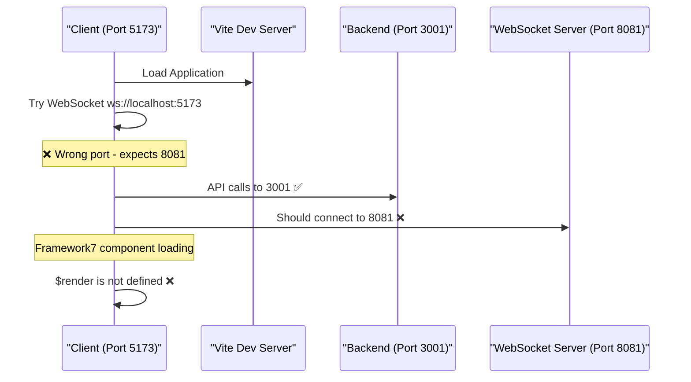
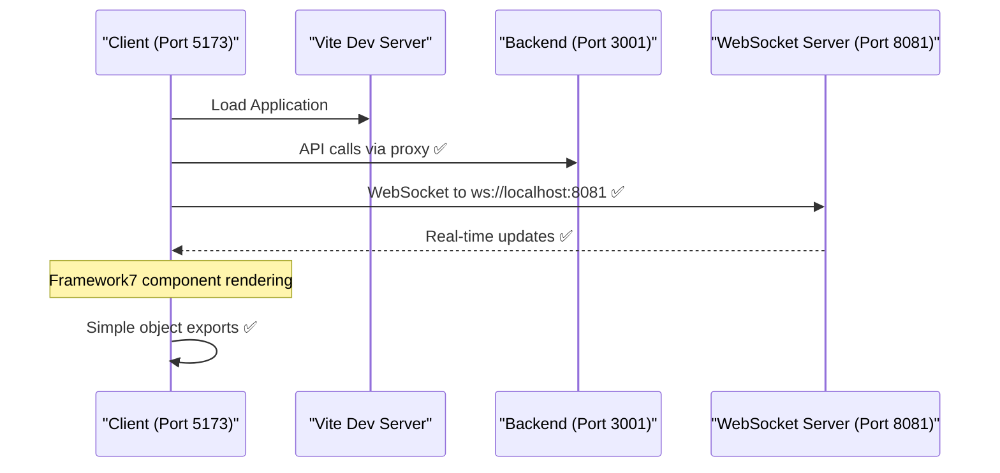
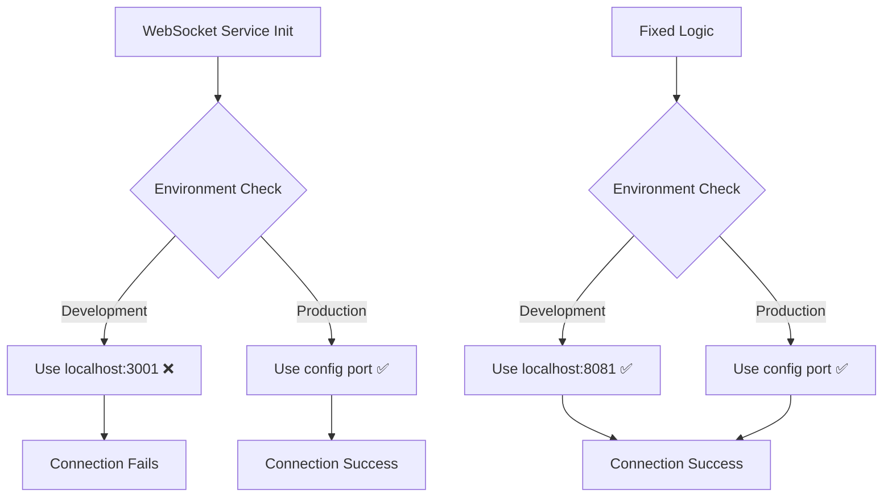

# WebSocket Connection Issue and Frontend Rendering Fix

## Overview

This design addresses critical issues preventing proper application functionality:

1. **WebSocket Connection Failure**: Client attempting to connect to wrong port (5173 instead of 8081)
2. **Framework7 Rendering Error**: `$render is not defined` error in component templates
3. **Service Worker Cache Conflicts**: Development assets being served from cache
4. **Vite HMR WebSocket Conflicts**: Development server WebSocket interfering with application WebSocket

## Architecture

### Current Issues Analysis



### Target Architecture



## Component Architecture

### WebSocket Service Configuration Fix

**Current Issue**: WebSocket service tries to connect to development server port instead of backend WebSocket port.

**Root Cause**: Development environment port detection logic incorrectly routes to Vite dev server.



### Framework7 Component Structure

**Current Issue**: Components using Framework7 8.x functional syntax incompatible with componentUrl loading.

**Solution**: Convert to simple object exports with string templates.

## Data Models & Configuration

### Environment Configuration Matrix

| Environment | Frontend Port | Backend API Port | WebSocket Port | Status |
|-------------|---------------|------------------|----------------|---------|
| Development | 5173 (Vite) | 3001 | 8081 | ❌ WS fails |
| Development (Fixed) | 5173 (Vite) | 3001 | 8081 | ✅ All working |
| Production | 8080 | 8080 | 8081 | ✅ Working |

### WebSocket Connection Parameters

```typescript
interface WebSocketConfig {
  development: {
    protocol: 'ws:',
    host: 'localhost',
    port: 8081,
    path: '/ws'
  },
  production: {
    protocol: 'wss:',
    host: 'auto-detect',
    port: 8081,
    path: '/ws'
  }
}
```

## Implementation Strategy

### 1. WebSocket Service Port Fix

**Problem**: WebSocket service uses incorrect port detection logic.

**Current Logic**:
```javascript
// ❌ Wrong: Uses 3001 in development, should use 8081
const wsPort = window.location.hostname === 'localhost' ? 3001 : port
```

**Fixed Logic**:
```javascript
// ✅ Correct: Always use WebSocket server port
const wsPort = window.location.hostname === 'localhost' ? 8081 : 8081
```

### 2. Framework7 Component Template Fix

**Problem**: Functional components with `$render` not compatible with componentUrl loading.

**Current Structure** (❌ Fails):
```javascript
const LoginComponent = async (props, { $h, $f7, $onMounted }) => {
  return () => $h`${templateHTML}` // ❌ $render not defined
}
```

**Fixed Structure** (✅ Works):
```javascript
export default {
  template: `<div class="page">...</div>`,
  data() {
    return { /* state */ }
  },
  methods: {
    /* component methods */
  },
  on: {
    pageInit() {
      /* initialization */
    }
  }
}
```

### 3. Service Worker Cache Management

**Problem**: Service worker caching development files prevents updates.

**Solution**: Update cache versioning and exclude development assets.

### 4. Vite Configuration Enhancement

**Problem**: HMR WebSocket conflicts with application WebSocket.

**Solution**: Configure separate WebSocket paths in Vite proxy.

## Configuration Updates

### Vite Configuration

```javascript
export default defineConfig({
  server: {
    port: 5173,
    proxy: {
      '/api': {
        target: 'http://localhost:3001',
        changeOrigin: true
      },
      // ✅ Add explicit WebSocket proxy
      '/ws': {
        target: 'ws://localhost:8081',
        ws: true,
        changeOrigin: true
      }
    },
    // ✅ Configure HMR to use different path
    hmr: {
      port: 5174, // Different port for HMR
      clientPort: 5174
    }
  }
})
```

### Service Worker Updates

```javascript
// ✅ Exclude development assets from caching
const DEVELOPMENT_PATTERNS = [
  /localhost:5173/,
  /\/@fs\//,
  /\/node_modules/,
  /\?v=/
];

// Skip caching for development assets
if (DEVELOPMENT_PATTERNS.some(pattern => pattern.test(event.request.url))) {
  return fetch(event.request);
}
```

## Testing Strategy

### Unit Testing

1. **WebSocket Service Tests**
   - Connection to correct port
   - Message handling
   - Reconnection logic
   - Authentication flow

2. **Component Loading Tests**
   - Template rendering
   - Event handler setup
   - Lifecycle methods
   - Error handling

### Integration Testing

1. **Development Environment**
   - Vite dev server startup
   - WebSocket connection establishment
   - Component loading and navigation
   - Service worker behavior

2. **Production Environment**
   - Docker container deployment
   - WebSocket server initialization
   - SSL/TLS WebSocket connections
   - Performance metrics

### Manual Testing Checklist

- [ ] Start development servers (`npm run dev`)
- [ ] Verify WebSocket connection in browser console
- [ ] Test component navigation without `$render` errors
- [ ] Confirm real-time updates work
- [ ] Test offline functionality
- [ ] Verify production build works

## Migration Steps

### Phase 1: WebSocket Port Fix
1. Update WebSocket service connection logic
2. Verify backend WebSocket server configuration
3. Test connection establishment

### Phase 2: Component Template Conversion
1. Convert login component to object export
2. Update route configuration
3. Test component loading

### Phase 3: Development Environment Optimization
1. Update Vite configuration
2. Modify service worker caching rules
3. Configure HMR separation

### Phase 4: Validation & Testing
1. Run full test suite
2. Manual testing in development
3. Production deployment verification

## Risk Assessment

| Risk | Impact | Mitigation |
|------|--------|------------|
| WebSocket connection fails | High | Fallback polling mechanism |
| Component rendering breaks | High | Gradual component conversion |
| Service worker conflicts | Medium | Cache versioning strategy |
| Development workflow disruption | Medium | Incremental updates |

## Monitoring & Alerts

### Key Metrics
- WebSocket connection success rate
- Component loading time
- Error rates in browser console
- Development server startup time

### Alert Conditions
- WebSocket connection failures > 5%
- Component rendering errors > 1%
- Service worker cache miss rate > 20%
- Development server restart frequency

## Performance Considerations

### Development Environment
- Separate HMR and application WebSocket ports
- Exclude large dependencies from HMR
- Optimize service worker caching strategy

### Production Environment
- WebSocket connection pooling
- Component lazy loading
- Service worker precaching optimization
- Bundle size monitoring